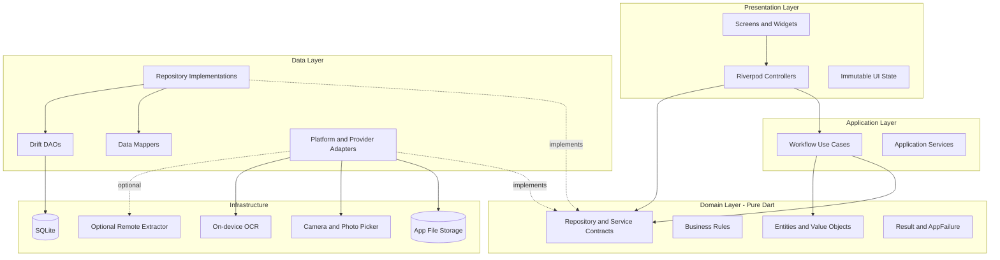
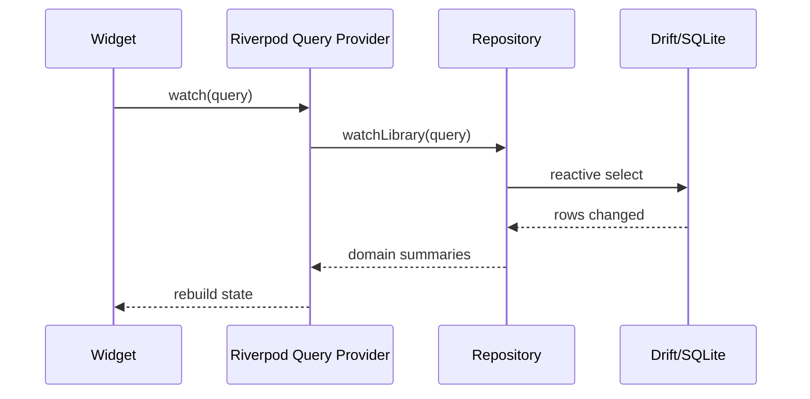
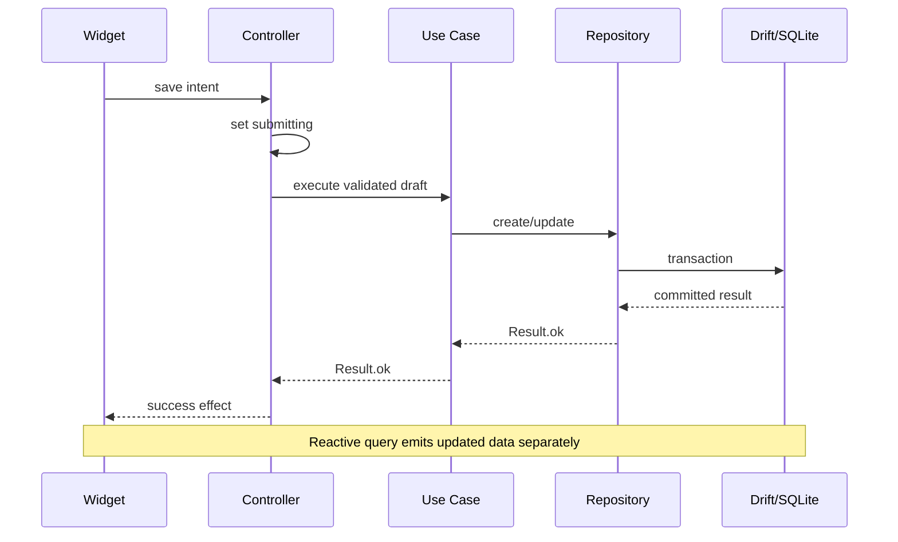
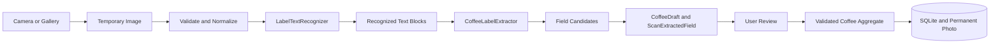
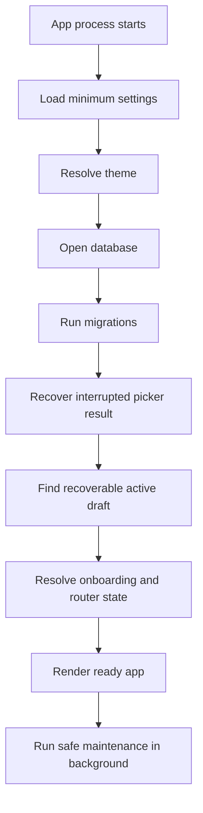

# Daily Coffee — Technical Architecture

> **Document type:** Technical Architecture Specification  
> **Status:** Baseline architecture untuk MVP  
> **Product:** Daily Coffee  
> **Platform:** Flutter untuk Android  
> **Architecture style:** Feature-first, pragmatic layered architecture  
> **Persistence:** Local-first relational database  
> **Related documents:** [`PRODUCT_REQUIREMENTS.md`](./PRODUCT_REQUIREMENTS.md) · [`DATA_MODEL.md`](./DATA_MODEL.md) · [`UI_SCREENS.md`](./UI_SCREENS.md) · [`DESIGN_SYSTEM.md`](./DESIGN_SYSTEM.md)

Dokumen ini mendefinisikan bagaimana Daily Coffee dibangun: batas layer, arah dependency, struktur proyek, state ownership, database, routing, OCR, file storage, error handling, testing, security, dan quality gates.

Dokumen ini tidak menggantikan requirement produk atau data contract. Jika ada konflik:

1. `PRODUCT_REQUIREMENTS.md` menentukan tujuan dan aturan produk.
2. `DATA_MODEL.md` menentukan makna data, invariant, dan relasi.
3. `UI_SCREENS.md` menentukan alur dan perilaku layar.
4. `DESIGN_SYSTEM.md` menentukan bahasa visual.
5. `ARCHITECTURE.md` menentukan implementasi teknis untuk memenuhi semuanya.

Perubahan teknis tidak boleh diam-diam mengubah requirement, data semantics, atau user flow.

---

## 1. Architecture Goals

Arsitektur harus:

- Dapat dikerjakan dan dipelihara oleh satu developer.
- Menjaga widget kecil dan bebas dari business/data logic.
- Menjadikan database lokal sebagai source of truth.
- Membuat core collection dan journal berfungsi offline.
- Memisahkan permanent data dari form/scan draft.
- Memperlakukan OCR sebagai bantuan yang selalu direview.
- Menjaga transaction dan referential integrity.
- Memungkinkan OCR provider diganti tanpa mengubah domain/UI utama.
- Memungkinkan feature diuji tanpa perangkat atau service nyata.
- Mendukung migration, export/import, dan recovery tanpa silent data loss.
- Menghindari boilerplate yang tidak memberi nilai nyata.
- Mempersiapkan pengembangan cloud sync tanpa memasukkannya ke MVP.

### Non-goals

Arsitektur MVP tidak ditujukan untuk:

- Microservices.
- Multi-package monorepo.
- Plugin architecture dinamis.
- Cloud-first synchronization.
- Event sourcing.
- Full CQRS dengan read/write database terpisah.
- Enterprise Clean Architecture dengan use case untuk setiap getter/setter.
- Account, authentication, marketplace, atau social feed.

---

## 2. Architectural Principles

### 2.1 Single source of truth

Database lokal adalah source of truth untuk coffee, journal, permanent photo metadata, dan persistent draft.

- UI tidak menyimpan shadow copy permanen.
- Setelah command berhasil, reactive database query memperbarui UI.
- In-memory state digunakan untuk interaction/form state, bukan authoritative persistent state.

### 2.2 Unidirectional data flow

```text
Persistent data
→ Repository query/stream
→ Riverpod provider/controller state
→ Widget render
→ User intent
→ Controller
→ Use case/repository command
→ Persistent data
```

Tidak ada direct mutation dari child widget ke database.

### 2.3 Separation of concerns

- Presentation menampilkan state dan meneruskan intent.
- Application mengorkestrasi workflow.
- Domain mendefinisikan aturan dan contract.
- Data mengimplementasikan persistence/platform integration.

### 2.4 Local-first

Core product tetap berguna tanpa jaringan. Remote dependency hanya boleh menambah kemampuan, bukan menjadi syarat untuk manual collection atau journal.

### 2.5 Explicit failure

Failure yang dapat diperkirakan direpresentasikan sebagai typed `AppFailure`, bukan raw SDK exception atau string.

### 2.6 Pragmatic abstraction

Abstraction dibuat jika:

- Ada business boundary.
- Ada kemungkinan implementasi platform/provider berubah.
- Dibutuhkan untuk testing.
- Mengisolasi side effect.
- Mengatur transaction/workflow kompleks.

Jangan membuat interface hanya agar semua class mempunyai interface.

### 2.7 Security and privacy by boundary

- External input tidak dipercaya.
- Secret tidak disimpan di client.
- OCR/file/import berada di balik adapter.
- Logging tidak boleh memuat konten sensitif.

---

## 3. High-Level Architecture



### Dependency rule

```text
Presentation → Application → Domain
Presentation ───────────────→ Domain
Data ───────────────────────→ Domain
Bootstrap → all concrete implementations
```

Domain tidak boleh mengimpor:

- Flutter.
- Riverpod.
- Drift.
- go_router.
- Camera/image picker.
- OCR SDK.
- File-system implementation.
- HTTP implementation.

---

## 4. Technology Decisions

| Area | Decision | Status |
|---|---|---|
| UI framework | Flutter stable | Accepted |
| Language | Dart stable | Accepted |
| State management and DI | Riverpod | Accepted |
| Provider style | Code-generated providers | Accepted |
| Database | SQLite through Drift | Accepted |
| Database execution | Background connection/isolate supported by Drift | Accepted |
| Navigation | `go_router` typed routes | Accepted |
| Root navigation | Stateful shell with three branches | Accepted |
| Camera | Official Flutter `camera` plugin | Accepted |
| Gallery | Official Flutter `image_picker` plugin | Accepted |
| Storage paths | Official Flutter `path_provider` plugin | Accepted |
| OCR | On-device-first behind adapter | Accepted |
| Structured extraction | Provider-neutral extractor contract | Accepted |
| Error contract | Sealed `Result<T>` and typed `AppFailure` | Accepted |
| Immutable generator | Plain Dart initially; Freezed not required | Accepted |
| Analytics | None for initial MVP | Accepted |
| External DI container | None; Riverpod is the composition mechanism | Accepted |
| Minimum Android | API 24 baseline, verified again when dependencies are locked | Provisional |

### Version policy

- Exact package versions live in `pubspec.yaml` and `pubspec.lock`.
- `pubspec.lock` is committed because Daily Coffee is an application.
- Architecture records package purpose, not a permanently hard-coded latest version.
- Major upgrades require changelog review, test run, and migration note.
- Minimum Android SDK is recalculated from locked dependency requirements.
- Dependency license and maintenance status are reviewed before release.

---

## 5. Project Structure

```text
lib/
├── app/
│   ├── app.dart
│   ├── bootstrap/
│   │   ├── app_bootstrap.dart
│   │   ├── bootstrap_controller.dart
│   │   └── bootstrap_state.dart
│   ├── routing/
│   │   ├── app_router.dart
│   │   ├── app_routes.dart
│   │   ├── route_paths.dart
│   │   └── route_not_found_screen.dart
│   └── localization/
│       ├── app_localizations.dart
│       └── arb/
│
├── core/
│   ├── design_system/
│   │   ├── theme/
│   │   └── components/
│   ├── database/
│   │   ├── app_database.dart
│   │   ├── database_connection.dart
│   │   ├── tables/
│   │   ├── daos/
│   │   ├── migrations/
│   │   └── converters/
│   ├── errors/
│   │   ├── app_failure.dart
│   │   ├── result.dart
│   │   └── exception_mapper.dart
│   ├── files/
│   │   ├── file_storage.dart
│   │   ├── managed_path.dart
│   │   └── orphan_cleanup.dart
│   ├── images/
│   │   ├── image_asset.dart
│   │   ├── image_processor.dart
│   │   └── image_validator.dart
│   ├── logging/
│   ├── platform/
│   ├── time/
│   ├── identifiers/
│   ├── validation/
│   └── utils/
│
├── features/
│   ├── coffee/
│   │   ├── domain/
│   │   │   ├── entities/
│   │   │   ├── value_objects/
│   │   │   ├── queries/
│   │   │   └── repositories/
│   │   ├── application/
│   │   │   └── use_cases/
│   │   ├── data/
│   │   │   ├── mappers/
│   │   │   └── repositories/
│   │   └── presentation/
│   │       ├── controllers/
│   │       ├── screens/
│   │       ├── state/
│   │       └── widgets/
│   ├── journal/
│   │   ├── domain/
│   │   ├── application/
│   │   ├── data/
│   │   └── presentation/
│   ├── capture/
│   │   ├── domain/
│   │   ├── application/
│   │   ├── data/
│   │   └── presentation/
│   ├── scan/
│   │   ├── domain/
│   │   ├── application/
│   │   ├── data/
│   │   └── presentation/
│   ├── onboarding/
│   ├── settings/
│   └── data_transfer/
│
└── main.dart

test/
├── unit/
├── database/
├── repositories/
├── providers/
├── widgets/
├── golden/
├── migrations/
├── fixtures/
└── helpers/

integration_test/
└── flows/
```

### Structure rules

- Feature owns presentation, workflow, repository implementation, dan domain-specific code.
- Shared infrastructure berada di `core`, bukan generic dumping ground.
- `core` tidak boleh bergantung pada feature.
- Feature boleh memakai `core` dan domain contract yang relevan.
- Cross-feature workflow berada di application layer feature yang menjadi owner atau service eksplisit.
- Jangan membuat folder global `models`, `services`, `controllers`, atau `screens` yang mencampur semua feature.
- File dipisahkan berdasarkan responsibility, bukan satu file per class secara dogmatis.

---

## 6. Layer Responsibilities

## 6.1 Presentation

Berisi:

- Screens dan reusable feature widgets.
- Riverpod controller/provider presentation.
- Immutable screen state.
- Form state.
- Formatting yang benar-benar khusus UI.
- Navigation intent dan UI effect handling.

Presentation boleh:

- Menggunakan Flutter, Riverpod, go_router, localization, dan design system.
- Membaca provider query.
- Memanggil public method controller.
- Mengubah domain data menjadi view-specific grouping.

Presentation tidak boleh:

- Menjalankan SQL/DAO.
- Mengakses filesystem secara langsung.
- Menggunakan OCR SDK secara langsung.
- Membuat repository sendiri.
- Menyimpan `BuildContext` pada controller.
- Mengubah persistent entity langsung.
- Menampilkan raw exception/provider response.

### Widget rule

Widget hanya mengandung:

- Rendering.
- Layout/animation.
- Focus dan text-editing concern.
- Kondisi sederhana berdasarkan UI state.
- Meneruskan user intent.

## 6.2 Application

Berisi use case/workflow yang:

- Melibatkan beberapa repository/service.
- Memerlukan transaction/compensation planning.
- Mengandung urutan penting.
- Mewakili operation product yang bermakna.

Use case MVP:

```text
CreateCoffeeFromDraft
UpdateCoffeeFromDraft
DeleteCoffeeGraph
CreateJournalEntry
UpdateJournalEntry
ProcessCoffeeLabel
PromoteScanDraft
RecoverInterruptedImagePick
DiscardCoffeeDraft
CleanupExpiredDrafts
CleanupOrphanAssets
ExportUserData
ImportUserData
DeleteAllUserData
```

Tidak perlu membuat use case untuk simple query atau setter tanpa business value.

## 6.3 Domain

Pure Dart, berisi:

- Entities dan aggregate.
- Value objects.
- Repository/service contracts.
- Query/filter value objects.
- Business validation.
- State machine rules.
- `Result<T>` dan `AppFailure` contracts.

Domain tidak mengetahui penyimpanan atau framework.

## 6.4 Data

Berisi:

- Drift schema/DAO use.
- Repository implementations.
- Row ↔ domain mapping.
- Camera/photo picker adapters.
- OCR adapters.
- File storage.
- Settings persistence.
- Export/import serialization.
- SDK/provider exception mapping.

Data layer menangkap exception implementasi dan mengubahnya menjadi typed failure.

---

## 7. Riverpod Architecture

Riverpod digunakan untuk:

- Dependency composition.
- Observable query state.
- Screen/controller state.
- Async loading/error state pada presentation.
- Dependency override dalam test.

Riverpod bukan permanent database dan tidak menggantikan Drift.

### 7.1 Provider taxonomy

#### Infrastructure providers

```text
databaseProvider
clockProvider
idGeneratorProvider
fileStorageProvider
imageProcessorProvider
cameraGatewayProvider
photoPickerGatewayProvider
labelTextRecognizerProvider
coffeeLabelExtractorProvider
appLoggerProvider
```

- Biasanya `keepAlive`.
- Dibuat melalui composition root.
- Memiliki interface agar dapat diganti fake.

#### Repository providers

```text
coffeeRepositoryProvider
journalRepositoryProvider
draftRepositoryProvider
settingsRepositoryProvider
dataTransferRepositoryProvider
```

- `keepAlive` selama aplikasi hidup.
- Menutup/dispose resource melalui `ref.onDispose` bila diperlukan.

#### Query providers

```text
coffeeLibraryProvider(CoffeeLibraryQuery)
coffeeDetailProvider(CoffeeId)
journalListProvider(JournalQuery)
journalForCoffeeProvider(CoffeeId)
coffeeSearchProvider(CoffeeSearchQuery)
activeDraftProvider(DraftId)
```

- Auto-dispose bila screen tidak membutuhkan lagi.
- Parameter harus immutable dan mempunyai equality stabil.
- Menghasilkan stream/future domain data, bukan Drift row.

#### Command controllers

```text
CoffeeFormController
CoffeeDeleteController
JournalFormController
ScanController
ImportController
ExportController
SettingsController
```

- Stateful provider class dengan public intent methods.
- Method mengubah state secara eksplisit.
- Side effect kompleks dialihkan ke use case.

### 7.2 Code generation

Gunakan Riverpod annotations/generator karena proyek sudah memakai code generation untuk Drift dan typed routes.

Rules:

- Generated files tidak diedit.
- Provider name stabil dan deskriptif.
- `keepAlive` hanya bila lifecycle benar-benar application-wide.
- Family parameter tidak memakai mutable object.
- Lint Riverpod diaktifkan.
- Jangan memakai legacy `StateNotifierProvider` untuk feature baru.
- Jangan menambahkan `hooks_riverpod` kecuali hook benar-benar memberi nilai.

### 7.3 State ownership

| State | Owner |
|---|---|
| Coffee/journal persisted | Drift database |
| Query/filter current | Feature provider/controller |
| Text editing cursor/focus | Widget |
| Form values | Form controller + persistent draft bila diperlukan |
| Camera controller | Capture screen/controller |
| Scan workflow status | Scan controller + draft persistence |
| Theme preference | Settings repository/provider |
| Current root route | Router |
| Snackbar/dialog display | Presentation effect handling |

### 7.4 UI effects

Snackbar, navigation, dan dialog tidak dipanggil dari repository/use case.

Controller menghasilkan result/state yang dibaca UI:

```text
Controller operation success
→ UI observes transition
→ UI navigates or shows snackbar
```

Pastikan effect tidak diputar ulang akibat rebuild. Gunakan operation ID, consumed effect, atau await result dari controller method yang jelas.

---

## 8. Domain Modeling

Domain mengikuti `DATA_MODEL.md`.

### 8.1 Aggregate boundaries

```text
Coffee aggregate
├── Coffee
├── CoffeeVariety[]
├── CoffeeTastingNote[]
└── CoffeePhoto[]

Journal aggregate
├── JournalEntry
└── JournalTastingNote[]

CoffeeDraft aggregate
├── CoffeeDraft
├── DraftVariety[]
├── DraftTastingNote[]
└── ScanExtractedField[]
```

### 8.2 Value objects

Gunakan value object ketika ada unit/invariant nyata:

```text
CoffeeId
JournalEntryId
DraftId
CoffeeName
RoasteryName
CoffeeQuantity
WaterTemperature
BrewDuration
Rating
BrewRatio
DateOnly
NormalizedTag
```

Jangan membungkus setiap string/int secara otomatis. Value object harus menyederhanakan aturan, bukan hanya menambah file.

### 8.3 Domain purity

Domain entity:

- Immutable.
- Tidak memiliki JSON/SQLite annotation.
- Tidak menerima `BuildContext`.
- Tidak menyimpan `File`, `XFile`, atau SDK-specific type.
- Menggunakan logical IDs/managed asset reference.
- Tidak mengetahui provider state.

### 8.4 Data mapping

```text
Drift generated row
↕ Mapper
Domain entity/aggregate
↕ Optional presentation mapper
UI state
```

Drift row tidak boleh keluar dari data layer.

---

## 9. Repository Architecture

Repository adalah source-of-truth boundary untuk satu domain area.

### 9.1 Coffee repository contract

Implementasi Phase 4 dijelaskan di `COFFEE_MANUAL_IMPLEMENTATION.md`; Phase 5
mengganti adapter produksi dengan Drift (lihat `LOCAL_PERSISTENCE_IMPLEMENTATION.md`).
Kontrak tetap menggunakan `CoffeeFormValues` untuk snapshot manual,
typed `Result` pada stream query, dan explicit `setFavorite`. Update memeriksa
snapshot awal; delete menerima `CoffeeDeleteImpact` terkonfirmasi dan memeriksa
revision/dampak secara atomik. Contoh berikut menunjukkan semantics repository,
bukan kewajiban memakai nama/signature yang sama persis.

```dart
abstract interface class CoffeeRepository {
  Stream<List<CoffeeSummary>> watchLibrary(CoffeeLibraryQuery query);
  Stream<Coffee?> watchCoffee(CoffeeId id);
  Future<Result<Coffee>> create(CoffeeDraftSnapshot draft);
  Future<Result<Coffee>> update(CoffeeId id, CoffeeDraftSnapshot draft);
  Future<Result<CoffeeDeleteImpact>> inspectDeleteImpact(CoffeeId id);
  Future<Result<void>> delete(CoffeeId id);
}
```

Nama final dapat berubah, tetapi semantics harus sama.

### 9.2 Journal repository contract

```dart
abstract interface class JournalRepository {
  Stream<List<JournalSummary>> watchEntries(JournalQuery query);
  Stream<List<JournalSummary>> watchForCoffee(CoffeeId coffeeId);
  Stream<JournalEntry?> watchEntry(JournalEntryId id);
  Future<Result<JournalEntry>> create(JournalDraft draft);
  Future<Result<JournalEntry>> update(JournalEntryId id, JournalDraft draft);
  Future<Result<void>> delete(JournalEntryId id);
}
```

### 9.3 Draft repository contract

```dart
abstract interface class DraftRepository {
  Stream<CoffeeDraft?> watch(DraftId id);
  Future<Result<CoffeeDraft>> create(CoffeeDraftType type);
  Future<Result<CoffeeDraft>> save(CoffeeDraftSnapshot draft);
  Future<Result<CoffeeDraft>> transition(
    DraftId id,
    CoffeeDraftStatus expected,
    CoffeeDraftStatus next,
  );
  Future<Result<void>> discard(DraftId id);
  Future<Result<List<CoffeeDraft>>> findRecoverable();
}
```

### 9.4 Rules

- Contract mengembalikan domain type/result.
- Implementation menggunakan DAO/file adapters.
- Repository tidak menampilkan UI feedback.
- Repository method command menjaga atomic database behavior.
- Cross-repository workflow berada di application use case.
- Jangan membuat repository generic CRUD base yang menghapus domain semantics.

---

## 10. Query and Command Architecture

Gunakan CQRS-lite.

### Query flow



### Command flow



### Rules

- Query tidak menyebabkan write.
- Command tidak mengelola UI list cache.
- Controller mencegah duplicate in-flight submission.
- Repository/use case tetap idempotent bila retry mempunyai operation key yang sama.
- Sort/filter object adalah immutable domain/application value.

---

## 11. Drift and SQLite Architecture

### 11.1 Database responsibilities

Drift menangani:

- Physical tables.
- Foreign keys.
- Indexes.
- Reactive queries.
- Transaction.
- Migration.
- Batch operation.
- In-memory/test database.

### 11.2 Connection

- Satu logical `AppDatabase` per application process.
- Database dibuka melalui background connection yang didukung Drift.
- Provider bertanggung jawab menutup database.
- Jangan membuka database instance baru pada setiap repository/screen.
- Jangan mengirim raw database instance secara sembarangan ke isolate lain.

### 11.3 DAO boundaries

```text
CoffeeDao
JournalDao
DraftDao
PhotoDao
SettingsDao
MaintenanceDao
```

DAO:

- Mengetahui Drift tables dan SQL.
- Tidak mengetahui UI/provider.
- Tidak membuat user-facing message.
- Mengembalikan rows/query result ke repository implementation.

### 11.4 Transactions

Wajib untuk:

- Create/update full coffee aggregate.
- Create/update journal aggregate.
- Draft promotion.
- Coffee deletion beserta related graph.
- Delete-all data.
- Import commit.

### 11.5 Referential integrity

- Foreign key enforcement aktif.
- `JournalEntry.coffeeId` tidak dapat orphan.
- Child tag/photo metadata tidak dapat orphan.
- Database constraints dan domain validation saling melengkapi.
- UI validation bukan authority terakhir.

### 11.6 Migration

- `schemaVersion` meningkat untuk structural change.
- Migration file tidak diubah setelah dirilis; buat langkah baru.
- Schema snapshot disimpan untuk test.
- Test fresh install dan upgrade dipisahkan.
- Migration failure tidak menyebabkan auto-reset database.
- Destructive migration memerlukan backup/recovery plan dan explicit decision.
- Export format version tidak disamakan dengan database schema version.

---

## 12. Form and Draft Architecture

### 12.1 Principle

Form tidak mengedit persisted entity langsung.

```text
Persisted entity
→ editable draft snapshot
→ user changes
→ validation
→ command/use case
→ transaction
→ persisted entity updated
```

### 12.2 Coffee form controller

```text
CoffeeFormState
├── draftId
├── mode: create | scanReview | edit
├── fields
├── child varieties
├── child tasting notes
├── photo state
├── validation errors
├── isDirty
├── isAutosaving
├── isSubmitting
├── lastAutosavedAt
└── submission failure
```

### 12.3 Text editing

- `TextEditingController` dan `FocusNode` dimiliki/dispose oleh widget.
- Controller menerima user values melalui intent method.
- Domain/repository tidak mengetahui Flutter editing objects.
- Initial values diset tanpa membuat change event palsu.

### 12.4 Draft persistence

- Persist perubahan dengan debounce yang wajar, bukan setiap keystroke secara sinkron.
- Explicit submit selalu menyimpan state terbaru.
- Draft recovery memvalidasi schema/version dan file reference.
- Invalid partial draft boleh disimpan untuk recovery.
- Invalid draft tidak boleh dipromosikan ke permanent entity.
- Exit guard hanya tampil jika ada perubahan yang berisiko hilang.

### 12.5 Draft cleanup

- Completed draft dibersihkan setelah integrity permanent data terverifikasi.
- Discarded draft dibersihkan setelah confirmation.
- Expired draft mengikuti retention policy.
- Cleanup memeriksa reference sebelum menghapus file.

---

## 13. OCR and Label Extraction Architecture

OCR dibagi menjadi dua kemampuan berbeda:

1. **Text recognition:** membaca karakter/blok teks dari gambar.
2. **Semantic extraction:** memetakan teks menjadi field coffee.

Jangan menyatukan keduanya dalam satu provider-specific service.

### 13.1 Pipeline



### 13.2 Contracts

```dart
abstract interface class LabelTextRecognizer {
  Future<Result<RecognizedLabelText>> recognize(ManagedImage image);
}

abstract interface class CoffeeLabelExtractor {
  Future<Result<CoffeeLabelCandidates>> extract(
    RecognizedLabelText text,
  );
}

abstract interface class ImageProcessor {
  Future<Result<ManagedImage>> normalize(TemporaryImage image);
}
```

Domain/application-owned contract tidak mengekspos type dari ML Kit atau external provider.

### 13.3 MVP strategy

- Gunakan on-device Latin text recognition sebagai baseline.
- Gunakan local deterministic parser untuk tanggal, berat, altitude, dan known vocabulary.
- Field yang ambigu ditandai `needsReview`.
- Jangan membuat nilai dari pengetahuan umum jika tidak ditemukan pada label.
- Review pengguna wajib.
- Manual fallback selalu tersedia.

### 13.4 Optional remote extractor

Jika proof of concept lokal tidak memenuhi target:

```text
Flutter
→ controlled backend/proxy
→ remote extraction provider
```

Rules:

- API secret tidak berada di Flutter client.
- Provider diakses melalui adapter.
- Upload memerlukan privacy disclosure yang sesuai.
- Timeout, retry, quota, dan rate limiting ditentukan.
- Remote failure tidak menghalangi manual flow.
- Provider response tetap untrusted.
- Raw image retention dievaluasi dan didokumentasikan.

### 13.5 Scan state machine

```text
editing
→ imageReady
→ processing
→ reviewRequired
→ readyToSave
→ completed

processing → failedRecoverable → processing
processing → failedRecoverable → editing/manual
active → discarded
inactive → expired
```

Controller memeriksa expected state sebelum transition untuk mencegah race/double process.

### 13.6 Cancellation

- Cancellation token/operation ID dimiliki scan controller/use case.
- Result lama diabaikan jika operation ID tidak lagi aktif.
- Cancel tidak membuat coffee parsial.
- SDK resource seperti recognizer/controller ditutup dengan benar.

---

## 14. Camera and Image Acquisition

### 14.1 Responsibilities

```text
CameraGateway
PhotoPickerGateway
ImageProcessor
ImageStorage
```

- `CameraGateway`: preview, permission result, capture.
- `PhotoPickerGateway`: system picker dan lost-result recovery.
- `ImageProcessor`: orientation, validation, metadata, size transformation.
- `ImageStorage`: temporary/permanent managed files.

### 14.2 Permission

- Permission diminta just-in-time.
- Rationale ditampilkan oleh presentation sebelum system prompt.
- Denied/permanently denied dipetakan menjadi typed failure.
- Gallery/manual fallback selalu tersedia.
- Storage permission luas tidak diminta jika system photo picker mencukupi.

### 14.3 Android interruption recovery

Image-picker result dapat hilang ketika Android menghentikan Activity. Bootstrap/recovery service harus memeriksa lost data dari plugin dan menghubungkannya kembali dengan recoverable draft.

Jika tidak dapat dihubungkan dengan aman:

- Jangan menebak target draft.
- Tawarkan recovery prompt atau buang temporary result dengan aman.

---

## 15. File Storage Architecture

### 15.1 Directory layout

```text
application-support/
├── database/
├── photos/
│   └── <coffee-id>/
│       └── <photo-id>.<ext>
├── maintenance/
└── exports-staging/

temporary/
├── drafts/
│   └── <draft-id>/
└── processing/
    └── <operation-id>/
```

Actual root directory diperoleh dari platform path provider.

### 15.2 Managed paths

- Database menyimpan relative managed reference bila memungkinkan.
- Filename menggunakan UUID.
- Jangan memasukkan nama coffee/user text ke filename.
- Path dari import/provider dinormalisasi dan divalidasi.
- Tidak ada `../` traversal.
- Tidak ada arbitrary absolute path sebagai trusted permanent reference.

### 15.3 Image processing

- Validasi MIME dari content.
- Normalisasi orientation.
- Batasi dimensi/ukuran sesuai keputusan prototype.
- Jangan decode full-resolution untuk thumbnail.
- Pertahankan detail label yang diperlukan OCR.
- Buang metadata yang tidak diperlukan jika aman.
- Hash content optional untuk integrity/dedup, bukan identitas utama.

### 15.4 File/database consistency

SQLite dan filesystem tidak memiliki shared transaction. Gunakan staged write:

```text
1. Validate temporary file
2. Prepare managed permanent candidate
3. Start database transaction
4. Write aggregate and photo metadata
5. Commit database transaction
6. Finalize file ownership
7. Cleanup temporary file
```

Jika terjadi failure:

- Pre-commit → rollback database dan candidate.
- Post-commit file failure → compensation atau maintenance marker.
- Cleanup failure → orphan cleanup queue; jangan merusak domain data.

### 15.5 File deletion

- Kumpulkan referenced paths sebelum transaction delete.
- Commit database deletion.
- Hapus file setelah commit.
- File yang gagal dihapus masuk maintenance cleanup.
- Cleanup selalu memeriksa bahwa path tidak lagi direferensikan.

---

## 16. Routing Architecture

Gunakan typed `go_router`.

### 16.1 Route topology

```text
Root
├── /onboarding
├── StatefulShellRoute
│   ├── /library
│   │   ├── /library/search
│   │   └── /coffee/:coffeeId
│   ├── /journal
│   │   └── /journal/:entryId
│   └── /settings
│       ├── /settings/data
│       └── /settings/about
├── /coffee/new
├── /coffee/capture
├── /coffee/scan/:draftId
├── /coffee/review/:draftId
├── /coffee/:coffeeId/edit
├── /journal/new
└── /journal/:entryId/edit
```

Final hierarchy menyesuaikan generated route constraints tanpa mengubah behavior `UI_SCREENS.md`.

### 16.2 Rules

- Stateful shell mempertahankan root tab state.
- Camera, scan, review, dan form fokus berada di luar bottom-nav shell.
- Route membawa ID/primitive serializable, bukan mutable domain entity.
- Detail memuat source-of-truth terbaru berdasarkan ID.
- Invalid/deleted ID menghasilkan not-found/recoverable state.
- Router redirect hanya untuk onboarding/bootstrap state, bukan business operation kompleks.
- Navigation side effect dipicu presentation setelah controller result.
- Route path tidak tersebar sebagai raw string di widget.

### 16.3 State restoration

- Root destination dapat dipulihkan.
- Form recovery berasal dari `draftId`, bukan serialization seluruh form ke route.
- Deep link ke detail mempunyai fallback root yang benar.
- Jangan menyimpan `BuildContext` atau navigator pada provider application-wide.

---

## 17. Bootstrap and Initialization

### 17.1 Minimal `main`

```dart
Future<void> main() async {
  WidgetsFlutterBinding.ensureInitialized();
  runApp(const ProviderScope(child: DailyCoffeeBootstrap()));
}
```

Concrete initialization terjadi melalui bootstrap controller/providers agar dapat diuji.

### 17.2 Sequence



### 17.3 Blocking initialization

Boleh memblokir initial app readiness:

- Minimum settings/theme.
- Database open.
- Required migration.
- Critical integrity check.

Tidak perlu memblokir:

- Expired draft cleanup.
- Orphan file cleanup.
- Optional diagnostics.
- Export staging cleanup.

### 17.4 Bootstrap state

```text
initializing
ready
recoverableFailure
fatalFailure
```

- Recoverable failure menawarkan retry.
- Fatal failure tidak otomatis menghapus database.
- Theme sudah diketahui sebelum main screen dirender untuk mencegah flash salah warna.

---

## 18. Result and Error Architecture

### 18.1 Result type

```dart
sealed class Result<T> {
  const Result();
}

final class Ok<T> extends Result<T> {
  const Ok(this.value);
  final T value;
}

final class Err<T> extends Result<T> {
  const Err(this.failure);
  final AppFailure failure;
}
```

Do not mix raw exceptions and `Result` randomly across the same public boundary.

### 18.2 Failure taxonomy

```text
AppFailure
├── ValidationFailure
├── NotFoundFailure
├── ConflictFailure
├── StorageFailure
├── MigrationFailure
├── PermissionDeniedFailure
├── PermissionPermanentlyDeniedFailure
├── CameraUnavailableFailure
├── ImageValidationFailure
├── OcrNoTextFailure
├── OcrUnavailableFailure
├── NetworkFailure
├── ExternalServiceFailure
├── ImportValidationFailure
├── ExportFailure
└── UnexpectedFailure
```

Failure membawa:

- Stable internal code.
- Safe diagnostic context.
- Optional original cause hanya untuk internal logging/debug.
- Tidak membawa user-facing localized string dari data/domain layer.

### 18.3 Boundary handling

```text
SDK/SQL/File exception
→ Data adapter catches
→ Exception mapper
→ AppFailure
→ Result.err
→ Controller maps to UI state
→ UI localization selects message/action
```

### 18.4 AsyncValue

- `AsyncValue` digunakan pada Riverpod presentation state.
- Domain/repository tidak mengembalikan `AsyncValue`.
- Business failure tetap typed dan dapat dibedakan dari unexpected failure.
- Previous data dapat dipertahankan saat refresh bila UX memerlukannya.

---

## 19. Offline Architecture

Core offline flows:

- Library read/search/filter/sort.
- Manual coffee CRUD.
- Journal CRUD.
- Settings/theme.
- Draft editing.
- On-device OCR jika model tersedia secara offline.

Repository lokal tidak memeriksa connectivity untuk operasi yang tidak memerlukan network.

Jika remote extractor ditambahkan:

```text
Local DB remains source of truth
Remote extractor only returns draft candidates
No remote result directly mutates permanent data
```

Jangan memakai network connectivity status sebagai bukti request pasti berhasil/gagal. Tangani actual request result.

---

## 20. Export and Import Architecture

Feature berada di `features/data_transfer`.

### 20.1 Export

```text
Read consistent database snapshot
→ Map domain aggregates to versioned DTO
→ Copy referenced images to staging
→ Create manifest
→ Build archive
→ Validate archive
→ User chooses destination
→ Share/save
→ Cleanup staging
```

Rules:

- Export tidak memakai screen query yang mungkin terfilter.
- Draft/raw OCR tidak diekspor secara default.
- Missing image dilaporkan.
- Output hanya disimpan ke destination yang dipilih pengguna.
- Export format mempunyai version sendiri.

### 20.2 Import

```text
User selects archive
→ Copy to staging
→ Validate container and paths
→ Validate manifest/version
→ Deserialize DTO
→ Validate all fields and relationships
→ Detect conflicts
→ Present summary
→ Transactional import to staging/main DB
→ Finalize images
→ Cleanup staging
```

Rules:

- Tidak mengekstrak path di luar staging.
- MIME diverifikasi.
- Existing data tidak berubah jika validation/commit gagal.
- ID conflict tidak overwrite diam-diam.
- First implementation menggunakan abort-with-summary untuk conflict.

---

## 21. Dependency Injection and Composition Root

Riverpod adalah satu-satunya DI/composition mechanism.

```text
databaseProvider
→ DAO provider
→ repository provider
→ use-case provider
→ controller provider
→ screen
```

### Rules

- Tidak memakai GetIt/service locator kedua.
- Tidak memakai singleton static mutable.
- Platform implementation dirakit di provider, bukan domain.
- Tests override provider pada boundary paling tepat.
- Clock dan ID generator dapat di-inject untuk deterministic test.
- Dispose lifecycle eksplisit.

### Environment configuration

Build-time environment hanya untuk non-secret configuration:

- Feature flags development.
- Endpoint identifier jika remote service nanti tersedia.
- Logging level default.

Secret server tidak boleh berada pada Dart define, asset, atau source client.

---

## 22. Localization Architecture

- Semua user-facing string memakai Flutter localization resource.
- Bahasa awal Bahasa Indonesia.
- Domain/data layer tidak mengembalikan localized message.
- Failure code dipetakan ke localized copy di presentation.
- Date/time/number display locale-aware.
- Proper noun coffee tidak diterjemahkan paksa.
- Design/test mempertimbangkan string lebih panjang.

Internal enum key stabil dan tidak sama dengan label UI:

```text
key: medium_light
label id: Medium-light
future label other locale: localized equivalent
```

---

## 23. Security and Privacy Architecture

### 23.1 Trust boundaries

Untrusted input:

- OCR text/provider response.
- Selected/imported file.
- Archive content.
- Image metadata.
- Future remote response.
- User text sebelum validation.

### 23.2 Rules

- Parameterized/type-safe database query.
- Validate path and MIME.
- Prevent archive path traversal.
- No API secret in client.
- TLS for future network request.
- Logs redact user content.
- Raw OCR/image not included in crash reports.
- No external analytics in initial MVP.
- No claim of encryption-at-rest unless implemented and audited.
- Permission requested only when feature is invoked.

### 23.3 Remote OCR security

If added:

- Client calls controlled backend.
- Backend owns provider credentials.
- Authentication/attestation decision documented.
- Upload size and format limited.
- Rate limits and quota enforced server-side.
- Retention/deletion behavior documented.
- User can choose manual path.

---

## 24. Logging and Observability

### 24.1 Categories

```text
bootstrap
database
migration
coffee
journal
capture
scan
filesystem
data_transfer
```

### 24.2 Logging rules

- Structured logs with event code.
- Debug detail disabled/reduced in release.
- Do not log personal notes.
- Do not log raw OCR text.
- Do not log image bytes.
- Avoid full local paths.
- Do not log secret/token.
- Provider error body sanitized.
- Correlation/operation ID may be logged.

### 24.3 Crash reporting

Not part of initial MVP. Jika ditambahkan:

- Berada di balik `CrashReporter` interface.
- Privacy disclosure diperbarui.
- Breadcrumb allowlist digunakan.
- User content tidak menjadi metadata.

---

## 25. Performance Strategy

### Database

- Background Drift connection.
- Index berdasarkan `DATA_MODEL.md`.
- Lazy/paginated list jika profiling memerlukan.
- Jangan query/join berat di widget build.
- Avoid N+1 query untuk journal count/photo metadata.

### Images

- Generate/use appropriately sized thumbnails.
- Decode sesuai target display dimension.
- Heavy resize/hash dapat dipindahkan dari UI isolate.
- Jangan memproses live camera frame jika still-image capture cukup.

### Search

- Debounce presentation query.
- Normalized indexed fields.
- Mulai dengan query relational sederhana.
- Tambah FTS hanya setelah profiling dan migration plan.

### Riverpod

- Watch provider sekecil yang diperlukan.
- Gunakan `select` ketika rebuild profiling menunjukkan manfaat.
- Jangan premature-optimize seluruh state menjadi provider mikro.
- Auto-dispose screen-scoped state.

### OCR

- Normalisasi satu kali per operation.
- Batasi dimensi input tanpa menghilangkan detail label.
- Close recognizer/resource.
- Operation ID mencegah stale result diterapkan.

---

## 26. Testing Strategy

### 26.1 Test pyramid

```text
                 Integration flows
              Widget and golden tests
       Controller, repository, database tests
              Domain and unit tests
```

Lebih banyak unit/database tests; lebih sedikit tetapi penting integration tests.

### 26.2 Unit tests

- Value object validation.
- Text normalization.
- Brew ratio.
- Draft state transitions.
- OCR parser.
- Result/failure mapping.
- Use-case orchestration dengan fakes.

### 26.3 Database tests

- Table constraints.
- Foreign keys.
- Aggregate transaction rollback.
- Cascade behavior.
- Search/filter/sort.
- Duplicate normalized child prevention.
- Migration dari setiap supported schema.
- Draft promotion idempotency.

### 26.4 Repository tests

- Row/domain mapping.
- Stream updates after command.
- Typed failure mapping.
- File compensation behavior.
- Delete impact calculation.

### 26.5 Provider/controller tests

- Initial/loading/success/error.
- Retry.
- Double-submit prevention.
- Provider override.
- Auto-dispose.
- Stale OCR result ignored.
- Draft autosave/recovery.

### 26.6 Widget tests

- Empty/loading/error/content state.
- Field validation/focus.
- Permission alternatives.
- Theme light/dark.
- Text scale 200%.
- Semantics.
- Keyboard and bottom action.

### 26.7 Golden tests

Selektif untuk:

- Design-system primitives.
- Coffee card.
- Detail header.
- Empty/error state.
- Light/dark regression.

Golden test tidak menggantikan behavior/accessibility test.

### 26.8 Integration tests

```text
First launch → onboarding → empty library
Manual coffee → save → detail → restart persistence
Camera permission denied → gallery/manual fallback
Photo → OCR → review → save
OCR no text/network failure → manual fallback
Coffee → journal → edit
Delete coffee with journal impact
Interrupted image picker → draft recovery
Migration from previous schema
Export → reset → import, if included
```

### 26.9 Test doubles

- Prefer fake repository/service dengan behavior nyata sederhana.
- Mock hanya interaction boundary yang perlu diverifikasi.
- Use real in-memory Drift untuk repository tests.
- Clock dan UUID generator deterministic.
- OCR fixture memakai recognized-text contract, bukan SDK native type.

---

## 27. Code Generation Policy

Code generators:

- Drift schema/data access.
- Riverpod providers.
- `go_router` typed routes.
- JSON serialization ketika export/import dibuat.

Rules:

- Satu `build_runner` workflow.
- Generated files tidak diedit.
- Generated output strategy konsisten; baseline: commit generated files untuk aplikasi solo.
- CI memeriksa generated output tidak stale.
- Jangan menambah generator untuk fungsi kecil.
- Freezed tidak digunakan dahulu; evaluasi jika union/state boilerplate menjadi masalah nyata.
- Domain tetap bebas dari Drift/JSON annotations kecuali keputusan ini direvisi secara eksplisit.

---

## 28. Dependency Policy

Sebelum menambah package:

1. Pastikan kebutuhan tidak dapat dipenuhi Flutter/Dart standard library secara wajar.
2. Periksa publisher dan repository.
3. Periksa maintenance activity dan issue penting.
4. Periksa license.
5. Periksa Android minimum SDK dan build impact.
6. Periksa permission/privacy.
7. Periksa binary size.
8. Pastikan package dapat dibungkus adapter bila menyentuh domain boundary.
9. Tambahkan test untuk perilaku kritis.
10. Dokumentasikan alasan bila dependency menjadi foundational.

Hindari umbrella package besar jika hanya satu sub-feature diperlukan.

---

## 29. Quality Gates

Setiap pull request atau milestone harus menjalankan:

```text
Dependency resolution
→ Code generation
→ Generated output freshness check
→ Dart formatting
→ Static analysis
→ Unit tests
→ Database/repository tests
→ Widget tests
→ Debug build
```

Untuk release candidate:

```text
All previous gates
→ Migration tests
→ Integration tests
→ Accessibility checks
→ Physical-device camera/OCR tests
→ Release build
→ Dependency/license review
→ Manual smoke test
```

Failure pada analyzer/test tidak boleh dilaporkan sebagai sukses hanya karena build lain berhasil.

---

## 30. Implementation Phases

### Phase 1 — Foundation

- Project setup dan strict analysis.
- Design system implementation.
- Riverpod composition root.
- Typed router and shell.
- Drift database, tables, migrations.
- Result/failure foundation.
- Localization.
- Test helpers.

### Phase 2 — Manual coffee collection

- Domain entities/value objects.
- Coffee repository/DAO.
- Library query.
- Manual form/draft.
- Detail/edit/delete.
- Search/filter/sort.
- File storage base.

### Phase 3 — Journal

- Journal repository/DAO.
- Journal form/detail/list.
- Coffee relation.
- Brew ratio and recipe validation.

### Phase 4 — Capture and OCR

- Camera/photo picker adapters.
- Lost-result recovery.
- Image staging/normalization.
- OCR adapter.
- Local structured extractor.
- Scan controller/state machine.
- Review/promotion flow.
- Physical-device verification.

### Phase 5 — Data control and hardening

- Settings/data/about.
- Cleanup maintenance.
- Export/import if included.
- Accessibility audit.
- Performance profiling.
- Security/privacy review.
- Release pipeline.

Manual coffee flow harus selesai sebelum OCR agar produk tetap berguna jika OCR tertunda.

---

## 31. Architecture Decision Records

Keputusan besar dicatat sebagai ADR terpisah jika berubah atau membutuhkan evaluasi mendalam.

Suggested ADRs:

```text
docs/adr/
├── 0001-feature-first-layered-architecture.md
├── 0002-riverpod-state-and-di.md
├── 0003-drift-sqlite-persistence.md
├── 0004-typed-go-router-navigation.md
├── 0005-on-device-first-ocr.md
├── 0006-managed-image-storage.md
├── 0007-result-and-failure-model.md
└── 0008-export-import-format.md
```

ADR minimum:

- Context.
- Decision.
- Alternatives considered.
- Consequences.
- Status.
- Date.

Jangan membuat ADR untuk keputusan styling kecil atau implementasi lokal yang mudah dibalik.

---

## 32. Forbidden Dependencies and Anti-Patterns

### Forbidden dependency paths

```text
domain → Flutter
domain → Drift
domain → Riverpod
domain → OCR SDK
widget → DAO/database
widget → filesystem
repository → BuildContext
controller → ScaffoldMessenger/Navigator instance
core → feature
```

### Anti-patterns

- God controller yang mengelola seluruh aplikasi.
- Repository generic CRUD tanpa domain semantics.
- Mutable global singleton.
- Dua DI systems.
- Dua state-management systems tanpa keputusan eksplisit.
- SQL di widget/controller.
- Drift row sebagai domain entity.
- OCR provider type bocor ke UI/domain.
- API key dalam APK.
- Form mengedit entity persistent langsung.
- `BuildContext` disimpan dalam provider.
- Navigation path raw tersebar.
- Comma-separated variety/tasting notes.
- Floating-point untuk persisted recipe quantity.
- Brew ratio disimpan sebagai source of truth.
- Catch-all error yang kehilangan category.
- Database reset otomatis saat migration gagal.
- Delete file sebelum database transaction berhasil.
- Fake progress percentage.
- Remote requirement untuk manual/offline flow.
- Feature placeholder interaktif yang belum bekerja.

---

## 33. Open Architecture Decisions

| ID | Decision | Recommended baseline |
|---|---|---|
| `ARCH-OPEN-001` | Flutter/Dart exact baseline | Latest stable compatible set at project creation |
| `ARCH-OPEN-002` | Drift executor/config | Native background database connection |
| `ARCH-OPEN-003` | ML Kit Flutter wrapper vs platform channel | Begin with audited adapter-wrapped plugin POC |
| `ARCH-OPEN-004` | Bundled vs unbundled OCR model | Bundled Latin for dependable offline behavior |
| `ARCH-OPEN-005` | Image max resolution/quality | Determine through OCR-quality prototype |
| `ARCH-OPEN-006` | Draft autosave debounce | Start around 500–1000 ms; verify UX/write frequency |
| `ARCH-OPEN-007` | Draft retention | 30 days inactive |
| `ARCH-OPEN-008` | File/database compensation mechanism | Maintenance queue/table |
| `ARCH-OPEN-009` | Pagination threshold | Add only after profiling realistic dataset |
| `ARCH-OPEN-010` | Export/import in first public release | Phase 5, before long-term usage if feasible |
| `ARCH-OPEN-011` | Generated files commit policy | Commit generated files |
| `ARCH-OPEN-012` | Crash reporting | None initially; privacy review before adding |

Open decision tidak memberi izin implementasi untuk memilih diam-diam. Resolution harus dicatat di dokumen/ADR.

---

## 34. Architecture Verification Checklist

### Boundaries

- [ ] Domain tidak mengimpor framework/infrastructure.
- [ ] Widget tidak mengakses DAO/file/OCR langsung.
- [ ] Repository implementation tidak bocor ke UI sebagai global singleton.
- [ ] Platform SDK berada di balik adapter.

### State

- [ ] Database adalah source of truth persistent.
- [ ] Provider lifecycle sesuai scope.
- [ ] Form mempunyai draft terpisah.
- [ ] Double submission dicegah.
- [ ] Stale async result tidak diterapkan.

### Data

- [ ] Drift row dipetakan ke domain.
- [ ] Foreign key enforcement aktif.
- [ ] Aggregate writes transactional.
- [ ] Migration tests tersedia.
- [ ] Numeric unit mengikuti `DATA_MODEL.md`.

### OCR and files

- [ ] OCR hanya menghasilkan draft.
- [ ] Manual fallback selalu tersedia.
- [ ] Temporary dan permanent path terpisah.
- [ ] File/database compensation diuji.
- [ ] Lost image-picker result ditangani.
- [ ] Secret provider tidak berada di client.

### Quality

- [ ] Static analysis clean.
- [ ] Tests sesuai risk layer.
- [ ] Generated output sinkron.
- [ ] Camera/OCR diuji pada perangkat fisik.
- [ ] Accessibility core flow diverifikasi.
- [ ] Failure tidak menyebabkan silent data loss.

---

## 35. Architecture Definition of Done

Arsitektur dianggap siap menjadi dasar implementasi jika:

- Semua accepted technology decision dapat dipasang pada Flutter stable yang dipilih.
- Project structure dan dependency rules terdokumentasi.
- Composition root dapat merakit database, repository, use case, dan controller.
- Database schema memetakan `DATA_MODEL.md` tanpa kehilangan semantics.
- Minimal vertical slice manual coffee dapat berjalan end-to-end.
- Query reactive dan command transaction dapat dibuktikan dengan test.
- Draft tidak muncul sebagai permanent entity.
- OCR/provider/file types tidak bocor ke domain.
- Result/failure contract digunakan konsisten.
- Migration dan file lifecycle mempunyai test strategy.
- Core flow dapat berjalan offline.
- Quality gates dapat dijalankan secara otomatis.
- Open decision yang menghalangi implementation phase terkait sudah diselesaikan.

---

## 36. AI Coding Assistant Guardrails

AI coding assistant wajib:

1. Membaca PRD, data model, UI screens, design system, dan section architecture terkait sebelum mengubah feature.
2. Mengikuti dependency direction.
3. Menyebutkan requirement/data rule yang dipenuhi.
4. Menggunakan repository sebagai persistent source of truth.
5. Membuat migration untuk schema change.
6. Membuat test untuk business rule, transaction, dan failure path.
7. Menempatkan SDK/package type di balik adapter.
8. Mempertahankan manual/offline fallback.
9. Menjaga user input pada recoverable failure.
10. Melaporkan verification gap secara jujur.

AI coding assistant dilarang:

- Mengubah layer rule demi menyelesaikan implementasi lebih cepat.
- Mengakses database dari widget/controller.
- Menggunakan entity Drift sebagai domain entity.
- Menambahkan state-management atau DI framework kedua.
- Membuat permanent coffee langsung dari OCR.
- Menyimpan secret pada client.
- Mengarang missing coffee data.
- Menambah dependency tanpa audit dasar.
- Menambah field/schema tanpa memperbarui data model dan migration.
- Menghapus database/file sebagai fallback error tanpa authorization.
- Menyebut feature selesai tanpa menguji failure state yang relevan.

Jika package memaksa pelanggaran boundary, bungkus dengan adapter atau usulkan perubahan arsitektur beserta trade-off; jangan membiarkan provider-specific type menyebar.

---

## 37. Primary Technical References

Referensi ini mendukung keputusan awal dan harus diperiksa kembali saat dependency dikunci:

- [Flutter architecture overview and guidance](https://docs.flutter.dev/app-architecture)
- [Flutter architecture recommendations](https://docs.flutter.dev/app-architecture/recommendations)
- [Flutter offline-first guidance](https://docs.flutter.dev/app-architecture/design-patterns/offline-first)
- [Flutter Result pattern](https://docs.flutter.dev/app-architecture/design-patterns/result)
- [Riverpod documentation](https://riverpod.dev/)
- [Riverpod code-generation guidance](https://riverpod.dev/docs/concepts/about_code_generation)
- [Drift documentation](https://drift.simonbinder.eu/)
- [Drift isolate guidance](https://drift.simonbinder.eu/isolates/)
- [go_router package](https://pub.dev/packages/go_router)
- [go_router_builder package](https://pub.dev/packages/go_router_builder)
- [Flutter camera package](https://pub.dev/packages/camera)
- [Flutter image_picker package](https://pub.dev/packages/image_picker)
- [Flutter path_provider package](https://pub.dev/packages/path_provider)
- [Google ML Kit Text Recognition for Android](https://developers.google.com/ml-kit/vision/text-recognition/v2/android)

---

## 38. Final Architecture Baseline

```text
Flutter Android
  + feature-first pragmatic layers
  + generated Riverpod for state and composition
  + Drift/SQLite as local source of truth
  + typed go_router navigation
  + explicit domain contracts and Result failures
  + persistent drafts for long-running forms/scan
  + managed file storage with compensation
  + on-device-first, provider-neutral OCR pipeline
  + manual/offline flow as mandatory fallback
  + tests at domain, database, provider, widget, and integration levels
```

Arsitektur ini harus berkembang melalui measured requirement, profiling, dan ADR—bukan melalui abstraction spekulatif.


## 39. Phase 6 Image Handling Decision - 29 September 2026

Still-photo MVP memakai kamera sistem melalui `image_picker`, bukan live preview
custom dengan package `camera`. `PhotoPickerGateway` membungkus kamera dan Android
Photo Picker serta lost-result recovery. Tidak ada permission storage luas atau
mikrofon. Kebutuhan custom camera dapat mengganti adapter pada fase berikutnya.

`core/images` menyediakan isolate processing, managed storage, dan cleanup.
Draft foto ditempatkan di app-support agar tidak bergantung pada OS cache.
Cover JPEG 2400 px / quality 90 dan thumbnail 480 px / quality 80 menjadi baseline
awal; raw original tidak diduplikasi permanen. Crop/rotate manual opsional ditunda.
`ARCH-OPEN-005` memakai baseline ini dan dievaluasi lagi dengan fixture OCR Phase 7.

Kebijakan staged write, exact draft association, checkpoint form, failure recovery,
dan verifikasi: [IMAGE_HANDLING_IMPLEMENTATION.md](IMAGE_HANDLING_IMPLEMENTATION.md).

## 40. Phase 7 OCR Decision - 29 September 2026

`LabelTextRecognizer` memakai adapter ML Kit Latin bundled melalui
`google_mlkit_text_recognition` 0.17.1. Raw text, line bounds, dan confidence
nullable memakai DTO netral provider. State machine dan operation ID berada
di scan controller; revisi draft di database menolak completion lama.
Cancellation bersifat logis, native recognizer ditutup setelah native work
selesai. Timeout 30 detik, retry eksplisit, dan input manual tetap tersedia.

Baseline gambar Phase 6 lolos fixture OCR satu/dua kolom dan kompresi ringan
pada emulator offline. Akurasi label fisik belum disimpulkan dari fixture ini.
Parser dan promotion tetap Phase 8. Lihat
[OCR_SCANNING_IMPLEMENTATION.md](OCR_SCANNING_IMPLEMENTATION.md).

## 41. Phase 8 Review Decision - 29 September 2026

Parser pure Dart menghasilkan kandidat deterministik; confidence OCR tidak
dianggap confidence kebenaran semantic. CoffeeDraft menyimpan editable snapshot
termasuk input invalid sementara di SQLite v3. Riverpod controller menserialisasi
autosave dan memeriksa revision. Review yang sudah dimulai tidak di-overwrite OCR.

User confirmation wajib sebelum promotion. Candidate file disiapkan sebelum
transaksi; Coffee/tags/photo metadata/cleanup task/draft deletion atomik dalam
transaksi yang memeriksa revisi draft. Gagal menyimpan mempertahankan draft.
Tidak ada remote extractor. Lihat [SCAN_REVIEW_IMPLEMENTATION.md](SCAN_REVIEW_IMPLEMENTATION.md).
