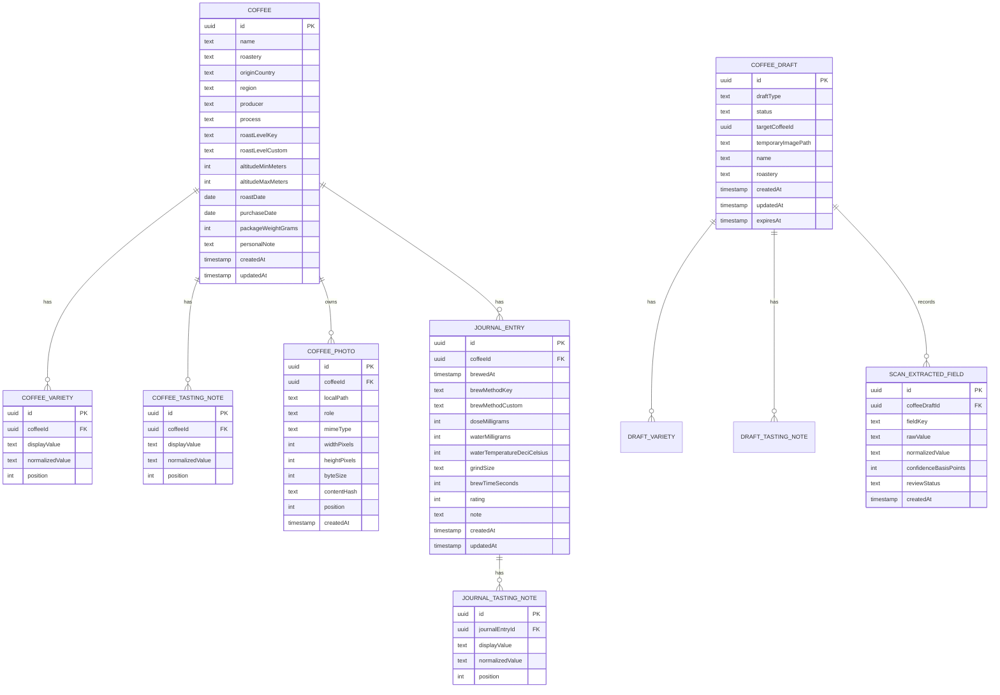

# Daily Coffee — Data Model Specification

> **Document type:** Logical Data Model and Data Contract  
> **Status:** Draft baseline untuk MVP  
> **Product:** Daily Coffee  
> **Primary platform:** Flutter untuk Android  
> **Storage direction:** Local-first, relational  
> **Related documents:** [`PRODUCT_REQUIREMENTS.md`](./PRODUCT_REQUIREMENTS.md) · [`UI_SCREENS.md`](./UI_SCREENS.md) · [`DESIGN_SYSTEM.md`](./DESIGN_SYSTEM.md)

Dokumen ini mendefinisikan makna data, entitas, field, relasi, constraint, normalisasi, lifecycle, delete behavior, query requirement, serta kontrak export/import Daily Coffee. Dokumen tidak memilih package database atau ORM tertentu.

Implementasi teknis boleh menyesuaikan sintaks dan tipe database, tetapi tidak boleh mengubah makna domain, invariant, nullability, relasi, atau lifecycle tanpa memperbarui dokumen ini.

---

## 1. Scope and Objectives

Data model harus mendukung:

- Koleksi kopi milik pengguna.
- Satu atau lebih variety dan tasting note untuk setiap kopi.
- Satu foto cover aktif pada UI MVP dengan kemampuan berkembang ke multi-photo.
- Journal entry yang terhubung ke kopi tertentu.
- Recipe dengan unit dan precision yang konsisten.
- Draft input manual dan hasil OCR yang belum menjadi data permanen.
- Search, filter, dan sort lokal.
- Penghapusan relasional yang aman.
- Export/import dan potensi sinkronisasi pada masa depan.
- Migration tanpa kehilangan data.

Data model tidak mencakup:

- Account, authentication, atau user profile.
- Cloud synchronization state.
- Marketplace, cart, price history, atau transaction.
- Social graph, public review, comment, dan reaction.
- Automatic inventory consumption.
- Roastery catalog global.

---

## 2. Domain Decisions

### 2.1 Meaning of `Coffee`

Satu `Coffee` merepresentasikan **satu kemasan, pembelian, atau lot kopi yang dicatat pengguna**, bukan katalog produk abstrak.

Jika kopi dengan nama dan roastery sama dibeli kembali dengan roast date atau kemasan berbeda, pengguna dapat membuat `Coffee` baru. Model tidak otomatis menggabungkan keduanya.

Contoh dua record yang valid:

```text
Coffee A
Ethiopia Hambela · Fugol Coffee · roast date 2026-01-12

Coffee B
Ethiopia Hambela · Fugol Coffee · roast date 2026-04-18
```

Keputusan ini menjaga hubungan foto, tanggal, berat kemasan, catatan pribadi, dan journal tetap jelas.

### 2.2 Snapshot over global catalog

Roastery, origin, region, producer, process, dan roast level disimpan sebagai snapshot pada `Coffee`. MVP tidak membuat master entity untuk masing-masing istilah tersebut.

Alasan:

- Kemasan adalah sumber informasi pengguna pada saat pencatatan.
- Istilah specialty coffee tidak selalu konsisten.
- Custom value harus didukung.
- Mengedit satu kopi tidak boleh diam-diam mengubah kopi lain.
- Normalisasi berlebihan menambah kompleksitas tanpa manfaat MVP yang sebanding.

### 2.3 User-reviewed persistence

Output OCR tidak pernah langsung menjadi `Coffee`. OCR menghasilkan `CoffeeDraft` dan `ScanExtractedField`. Hanya save eksplisit setelah review yang membuat atau memperbarui record permanen.

### 2.4 Local-first identity

Semua entity permanen menggunakan UUID yang dibuat di perangkat. UUID memungkinkan export/import dan kemungkinan sync di masa depan tanpa bergantung pada auto-increment lokal.

### 2.5 Source values and derived values

- Source values disimpan.
- Derived values dihitung saat dibutuhkan.
- Brew ratio tidak disimpan karena dapat dihitung dari dose dan water.
- Search-normalized values dapat disimpan sebagai derived index fields untuk performa.

---

## 3. Modeling Conventions

### 3.1 Naming

- Nama entity: singular `PascalCase`.
- Nama logical field: `camelCase`.
- Contoh physical SQL menggunakan `snake_case` bila diperlukan.
- Foreign key memakai format `<entityName>Id`.
- Timestamp sistem memakai suffix `At`.
- Nilai normalisasi memakai suffix `Normalized`.

### 3.2 ID

- Logical type: UUID.
- Serialized form: lowercase canonical UUID string.
- ID dibuat sebelum record pertama kali disimpan.
- ID tidak berubah setelah dibuat.
- ID tidak memiliki arti bisnis dan tidak ditampilkan kepada pengguna.

### 3.3 Timestamp and date

- System timestamp (`createdAt`, `updatedAt`) disimpan dalam UTC.
- User datetime (`brewedAt`) disimpan sebagai instant yang tidak ambigu, beserta informasi yang cukup untuk menampilkan waktu yang dimaksud pengguna.
- Date-only (`roastDate`, `purchaseDate`) tidak boleh diam-diam dikonversi menjadi tengah malam UTC karena dapat bergeser hari.
- Display mengikuti locale dan timezone perangkat.

### 3.4 Null and empty values

- Optional value yang tidak diketahui disimpan sebagai `null`.
- Empty string dan whitespace-only tidak valid sebagai persisted value.
- Empty collection direpresentasikan sebagai tidak adanya child row, bukan satu row kosong.
- Angka `0` bukan pengganti `null`.

### 3.5 Numeric precision

Untuk menghindari floating-point drift, persisted quantity menggunakan integer dalam unit terkecil yang ditetapkan:

| Domain value | Persisted unit | Example |
|---|---|---|
| Berat kemasan | gram | `200 g` → `200` |
| Dose kopi | milligram | `15.5 g` → `15500` |
| Air | milligram | `250 g` → `250000` |
| Suhu | deci-degree Celsius | `93.5 °C` → `935` |
| Brew time | second | `2:30` → `150` |
| Altitude | meter | `1,800 masl` → `1800` |
| Rating | integer 1–5 | `4` → `4` |

Conversion untuk UI harus berada di satu utility/domain abstraction yang diuji, bukan tersebar di widget.

### 3.6 Text length

Database dapat menggunakan tipe text tanpa batas pendek yang rapuh. Namun aplikasi tetap harus menerapkan reasonable validation untuk mencegah input tidak disengaja, file import berbahaya, atau payload ekstrem. Limit final ditetapkan di arsitektur/validation specification dan harus konsisten antara form, import, dan persistence.

---

## 4. Entity Relationship Diagram



`AppSettings` dan metadata schema tidak ditampilkan pada diagram karena bukan bagian relasi domain utama.

---

## 5. Entity Summary

| Entity | Persistence | Purpose |
|---|---|---|
| `Coffee` | Permanent | Satu kemasan/pembelian/lot dalam koleksi |
| `CoffeeVariety` | Permanent child | Satu variety yang tercantum untuk coffee |
| `CoffeeTastingNote` | Permanent child | Profil rasa pada kemasan/coffee description |
| `CoffeePhoto` | Permanent child | Metadata dan reference foto coffee |
| `JournalEntry` | Permanent | Satu pengalaman atau resep seduh |
| `JournalTastingNote` | Permanent child | Rasa yang dialami pengguna saat menyeduh |
| `CoffeeDraft` | Temporary/recoverable | Form manual, scan review, atau edit draft |
| `DraftVariety` | Temporary child | Variety pada draft |
| `DraftTastingNote` | Temporary child | Tasting note pada draft |
| `ScanExtractedField` | Temporary child | Provenance dan review status per OCR field |
| `AppSettings` | Persistent preference | Theme, onboarding, dan preference lokal |
| `SchemaMetadata` | Internal persistent | Versi schema dan migration metadata |

---

## 6. `Coffee`

### 6.1 Purpose

Merepresentasikan satu coffee bag/purchase/lot yang disimpan pengguna.

### 6.2 Fields

| Field | Logical type | Null | Rule |
|---|---|---:|---|
| `id` | UUID | Tidak | Stable primary key |
| `name` | Text | Tidak | Trimmed, non-empty |
| `nameNormalized` | Text | Tidak | Derived untuk search/sort |
| `roastery` | Text | Tidak | Trimmed, non-empty |
| `roasteryNormalized` | Text | Tidak | Derived untuk search/sort |
| `originCountry` | Text | Ya | Display value yang diberikan pengguna/OCR |
| `originCountryNormalized` | Text | Ya | Derived untuk search/filter |
| `originCountryCode` | ISO 3166-1 alpha-2 | Ya | Hanya jika mapping yakin atau dipilih pengguna |
| `region` | Text | Ya | Region, farm, estate, cooperative, atau station |
| `regionNormalized` | Text | Ya | Derived untuk search |
| `producer` | Text | Ya | Producer/farmer/cooperative |
| `producerNormalized` | Text | Ya | Derived untuk search |
| `process` | Text | Ya | Display value; custom allowed |
| `processNormalized` | Text | Ya | Derived untuk filter/search |
| `roastLevelKey` | Enum key | Ya | Controlled key atau `other` |
| `roastLevelCustom` | Text | Ya | Hanya digunakan ketika key `other` |
| `altitudeMinMeters` | Positive integer | Ya | Meter di atas permukaan laut |
| `altitudeMaxMeters` | Positive integer | Ya | Harus ≥ minimum jika keduanya ada |
| `altitudeSourceText` | Text | Ya | Optional preservation dari label, misalnya `1,800–2,100 masl` |
| `roastDate` | Date-only | Ya | Tanggal roasting |
| `purchaseDate` | Date-only | Ya | Tanggal pembelian |
| `packageWeightGrams` | Positive integer | Ya | Berat awal kemasan |
| `personalNote` | Text | Ya | Catatan pribadi tentang coffee, bukan brew entry |
| `isFavorite` | Boolean | Tidak | Default false; ditambahkan sesuai tracker Phase 4, bukan rating/pinned order |
| `createdAt` | UTC timestamp | Tidak | Immutable setelah insert |
| `updatedAt` | UTC timestamp | Tidak | Berubah pada update record/owned content yang relevan |

### 6.3 Invariants

- `name.trim()` tidak kosong.
- `roastery.trim()` tidak kosong.
- `nameNormalized` berasal dari `name` dan tidak ditulis bebas oleh UI.
- `roasteryNormalized` berasal dari `roastery`.
- Jika `originCountryCode` terisi, format harus dua huruf uppercase dan valid menurut daftar yang dipilih aplikasi.
- Jika `roastLevelKey != other`, `roastLevelCustom` harus `null`.
- Jika `roastLevelKey == other`, `roastLevelCustom` harus non-empty.
- Jika `altitudeMinMeters` dan `altitudeMaxMeters` terisi, max ≥ min.
- `packageWeightGrams > 0` jika terisi.
- `updatedAt >= createdAt`.

### 6.4 Roast level controlled keys

```text
light
medium_light
medium
medium_dark
dark
other
```

Key adalah stable machine value. Label UI dilokalkan. Custom text digunakan hanya untuk `other`.

### 6.5 Why no price or inventory fields

Harga dan remaining weight tidak masuk MVP karena produk bukan expense tracker atau inventory manager. Field tersebut hanya boleh ditambahkan melalui perubahan requirement, bukan sebagai asumsi data model.

---

## 7. `CoffeeVariety`

### 7.1 Purpose

Menyimpan multiple coffee varieties tanpa comma-separated string.

### 7.2 Fields

| Field | Logical type | Null | Rule |
|---|---|---:|---|
| `id` | UUID | Tidak | Primary key |
| `coffeeId` | UUID | Tidak | FK → `Coffee.id` |
| `displayValue` | Text | Tidak | Nilai yang dilihat pengguna |
| `normalizedValue` | Text | Tidak | Derived untuk compare/filter |
| `position` | Non-negative integer | Tidak | Urutan tampilan |
| `createdAt` | UTC timestamp | Tidak | Audit/order support |

### 7.3 Constraints

- Cascade bersama coffee menurut delete policy.
- `displayValue.trim()` tidak kosong.
- Unique logical pair: `(coffeeId, normalizedValue)`.
- Position unik per coffee sebaiknya dijaga atau dinormalisasi saat write.

### 7.4 Example

```json
[
  { "displayValue": "74110", "normalizedValue": "74110", "position": 0 },
  { "displayValue": "74112", "normalizedValue": "74112", "position": 1 }
]
```

---

## 8. `CoffeeTastingNote`

### 8.1 Purpose

Menyimpan profil rasa yang dikaitkan dengan coffee atau tertulis pada kemasan. Ini bukan rasa yang dialami dalam satu seduhan.

### 8.2 Fields

| Field | Logical type | Null | Rule |
|---|---|---:|---|
| `id` | UUID | Tidak | Primary key |
| `coffeeId` | UUID | Tidak | FK → `Coffee.id` |
| `displayValue` | Text | Tidak | Misalnya `Peach` |
| `normalizedValue` | Text | Tidak | Misalnya `peach` |
| `position` | Non-negative integer | Tidak | Urutan label/pengguna |
| `createdAt` | UTC timestamp | Tidak | Audit support |

### 8.3 Constraints

- Unique logical pair: `(coffeeId, normalizedValue)`.
- Tidak boleh dibuat dari asumsi AI tanpa hasil scan atau input yang direview.
- Cascade bersama coffee menurut delete policy.

---

## 9. `CoffeePhoto`

### 9.1 Purpose

Menyimpan metadata dan reference foto yang dimiliki coffee. UI MVP hanya mengizinkan satu foto aktif sebagai cover, tetapi model mendukung penambahan foto pada masa depan.

### 9.2 Fields

| Field | Logical type | Null | Rule |
|---|---|---:|---|
| `id` | UUID | Tidak | Primary key |
| `coffeeId` | UUID | Tidak | FK → `Coffee.id` |
| `localPath` | Text | Tidak | App-managed relative/reference path, bukan arbitrary external path |
| `role` | Enum key | Tidak | `cover` pada MVP; future roles harus didokumentasikan |
| `mimeType` | Text | Tidak | Valid supported image MIME |
| `widthPixels` | Positive integer | Tidak | Width setelah normalization |
| `heightPixels` | Positive integer | Tidak | Height setelah normalization |
| `byteSize` | Non-negative integer | Tidak | Ukuran persisted file |
| `contentHash` | Text | Ya | Hash untuk integrity/dedup jika digunakan |
| `source` | Enum key | Tidak | `camera`, `gallery`, `scan`, `import` |
| `position` | Non-negative integer | Tidak | Default `0` pada MVP |
| `createdAt` | UTC timestamp | Tidak | Creation/import time |

### 9.3 Constraints

- Hanya satu photo dengan `role = cover` per coffee.
- `localPath` harus berada dalam storage scope yang dikelola aplikasi atau melalui durable URI contract yang tervalidasi.
- Photo row tidak boleh menunjuk temporary file yang akan dibersihkan sebelum coffee dihapus.
- File dan database write harus dikoordinasikan agar tidak meninggalkan broken reference.
- Deleting/replacing photo tidak boleh menghapus file sebelum database transaction berhasil.

### 9.4 File lifecycle

```text
Capture/select
→ temporary file
→ normalize/validate
→ user confirms
→ copy/move to app-owned permanent location
→ create CoffeePhoto row
→ remove unreferenced temporary file
```

Jika save database gagal, permanent candidate harus di-rollback atau ditandai untuk cleanup. Jika file deletion gagal setelah database commit, catat orphan cleanup task tanpa mengembalikan deleted record.

---

## 10. `JournalEntry`

### 10.1 Purpose

Merepresentasikan satu pengalaman seduh untuk tepat satu coffee.

### 10.2 Fields

| Field | Logical type | Null | Rule |
|---|---|---:|---|
| `id` | UUID | Tidak | Stable primary key |
| `coffeeId` | UUID | Tidak | FK → valid `Coffee.id` |
| `brewedAt` | Zoned/offset-aware datetime | Tidak | Default waktu saat dibuat, editable |
| `brewMethodKey` | Enum key | Tidak | Controlled key atau `other` |
| `brewMethodCustom` | Text | Ya | Required hanya jika key `other` |
| `doseMilligrams` | Positive integer | Ya | UI menampilkan gram |
| `waterMilligrams` | Positive integer | Ya | UI menampilkan gram |
| `waterTemperatureDeciCelsius` | Integer | Ya | UI menampilkan °C |
| `grindSize` | Text | Ya | Deskripsi atau grinder setting |
| `brewTimeSeconds` | Positive integer | Ya | UI format `mm:ss` |
| `rating` | Integer 1–5 | Ya | Personal rating; no default |
| `note` | Text | Ya | Free-form observation |
| `createdAt` | UTC timestamp | Tidak | Immutable creation time |
| `updatedAt` | UTC timestamp | Tidak | Last modification time |

### 10.3 Invariants

- `coffeeId` harus menunjuk coffee yang ada.
- `brewMethodKey` tidak boleh kosong.
- Jika key `other`, `brewMethodCustom` wajib non-empty.
- Jika key bukan `other`, custom harus `null`.
- Dose, water, temperature, dan brew time harus positif jika terisi.
- Temperature validation harus menangkap nilai jelas tidak sengaja, tetapi batas final perlu mempertimbangkan cold brew dan custom method.
- Rating null atau integer 1–5.
- `updatedAt >= createdAt`.

### 10.4 Suggested brew method keys

```text
v60
kalita_wave
origami
aeropress
french_press
chemex
clever_dripper
espresso
moka_pot
cold_brew
cupping
other
```

Daftar dapat dikembangkan melalui perubahan data yang backward-compatible. UI label dilokalkan dan custom method tetap didukung.

### 10.5 Derived brew ratio

Brew ratio hanya tersedia jika dose dan water valid:

```text
ratio = waterMilligrams / doseMilligrams
display = 1 : roundedRatio
```

Contoh:

```text
doseMilligrams  = 15000
waterMilligrams = 240000
ratio           = 16
display         = 1:16
```

Ratio tidak disimpan. Rounding/format rule harus konsisten di seluruh aplikasi dan diuji.

---

## 11. `JournalTastingNote`

### 11.1 Purpose

Menyimpan rasa yang benar-benar dirasakan pengguna pada satu journal entry. Nilai ini tidak mengubah `CoffeeTastingNote`.

### 11.2 Fields

| Field | Logical type | Null | Rule |
|---|---|---:|---|
| `id` | UUID | Tidak | Primary key |
| `journalEntryId` | UUID | Tidak | FK → `JournalEntry.id` |
| `displayValue` | Text | Tidak | User-facing value |
| `normalizedValue` | Text | Tidak | Compare/search value |
| `position` | Non-negative integer | Tidak | User-selected order |
| `createdAt` | UTC timestamp | Tidak | Audit support |

### 11.3 Constraints

- Unique logical pair: `(journalEntryId, normalizedValue)`.
- Cascade saat journal entry dihapus.
- Suggestion dari coffee profile boleh ditawarkan, tetapi row hanya dibuat setelah dipilih pengguna.

---

## 12. `CoffeeDraft`

### 12.1 Purpose

Menyimpan input yang belum menjadi coffee permanen, termasuk manual entry, hasil scan, atau draft edit yang dapat dipulihkan.

### 12.2 Draft types

```text
manual_create
scan_create
edit_existing
```

### 12.3 Draft statuses

```text
editing
image_ready
processing
review_required
ready_to_save
failed_recoverable
completed
discarded
expired
```

### 12.4 Fields

| Field | Logical type | Null | Rule |
|---|---|---:|---|
| `id` | UUID | Tidak | Primary key |
| `draftType` | Enum key | Tidak | Salah satu draft type |
| `status` | Enum key | Tidak | Mengikuti allowed transition |
| `targetCoffeeId` | UUID | Ya | Wajib hanya untuk `edit_existing` |
| `temporaryImagePath` | Text | Ya | App-controlled temporary reference |
| `imageMimeType` | Text | Ya | Harus ada jika temp image ada |
| `name` | Text | Ya | Draft boleh belum lengkap |
| `roastery` | Text | Ya | Draft boleh belum lengkap |
| `originCountry` | Text | Ya | Snapshot draft |
| `originCountryCode` | Text | Ya | Optional reviewed mapping |
| `region` | Text | Ya | Snapshot draft |
| `producer` | Text | Ya | Snapshot draft |
| `process` | Text | Ya | Snapshot draft |
| `roastLevelKey` | Enum key | Ya | Sama dengan coffee contract |
| `roastLevelCustom` | Text | Ya | Sama dengan coffee contract |
| `altitudeMinMeters` | Integer | Ya | Draft value |
| `altitudeMaxMeters` | Integer | Ya | Draft value |
| `altitudeSourceText` | Text | Ya | Raw/review context |
| `roastDate` | Date-only | Ya | Draft value |
| `purchaseDate` | Date-only | Ya | Draft value |
| `packageWeightGrams` | Integer | Ya | Draft value |
| `personalNote` | Text | Ya | Draft value |
| `failureCategory` | Enum/text key | Ya | Sanitized recoverable failure |
| `createdAt` | UTC timestamp | Tidak | Creation time |
| `updatedAt` | UTC timestamp | Tidak | Last draft change |
| `expiresAt` | UTC timestamp | Ya | Cleanup eligibility, bukan silent delete command |

### 12.5 Draft differences from permanent data

- Required coffee fields boleh kosong.
- Invalid partial input dapat disimpan untuk recovery, tetapi tidak dapat dipromosikan sampai valid.
- Draft tidak muncul di library atau search permanen.
- Draft memiliki expiration/cleanup policy terpisah.
- `completed` berarti conversion berhasil; bukan coffee record itu sendiri.

### 12.6 Draft transition rules

```text
manual_create:
editing → ready_to_save → completed
              ↘ failed_recoverable → ready_to_save

scan_create:
editing → image_ready → processing → review_required → ready_to_save → completed
                            ↘ failed_recoverable → processing
                            ↘ failed_recoverable → editing/manual fallback

any active state → discarded
inactive past policy → expired
```

- Invalid transition harus ditolak oleh domain layer.
- `completed`, `discarded`, dan `expired` adalah terminal states.
- Conversion draft → coffee dan pemindahan photo reference harus dilakukan secara atomik sejauh storage memungkinkan.

---

## 13. `DraftVariety` and `DraftTastingNote`

Draft child entities mempunyai struktur yang sama dengan permanent child, tetapi foreign key mengarah ke `CoffeeDraft`.

| Field | Logical type | Null | Rule |
|---|---|---:|---|
| `id` | UUID | Tidak | Primary key |
| `coffeeDraftId` | UUID | Tidak | FK → `CoffeeDraft.id` |
| `displayValue` | Text | Tidak | Draft display value |
| `normalizedValue` | Text | Tidak | Derived |
| `position` | Non-negative integer | Tidak | Ordering |
| `source` | Enum key | Tidak | `user`, `ocr`, atau `suggestion_selected` |

Draft children tidak boleh dicampur dengan permanent children sampai conversion transaction berhasil.

---

## 14. `ScanExtractedField`

### 14.1 Purpose

Menyimpan provenance, raw result, normalization, confidence, dan review status untuk setiap field hasil scan.

### 14.2 Fields

| Field | Logical type | Null | Rule |
|---|---|---:|---|
| `id` | UUID | Tidak | Primary key |
| `coffeeDraftId` | UUID | Tidak | FK → `CoffeeDraft.id` |
| `fieldKey` | Stable enum/text key | Tidak | Target domain field |
| `rawValue` | Text | Ya | Nilai langsung dari OCR/extractor |
| `normalizedValue` | Text | Ya | Candidate value setelah normalization |
| `confidenceBasisPoints` | Integer 0–10000 | Ya | Internal only; `null` jika provider tidak memberi nilai bermakna |
| `reviewStatus` | Enum key | Tidak | Status review field |
| `sourceRegion` | Structured JSON/text | Ya | Optional bounding box/page reference; provider-neutral |
| `createdAt` | UTC timestamp | Tidak | Extraction time |
| `updatedAt` | UTC timestamp | Tidak | Review/normalization update |

### 14.3 Supported field keys

```text
name
roastery
origin_country
region
producer
process
varieties
roast_level
tasting_notes
altitude
roast_date
package_weight
```

### 14.4 Review statuses

```text
unreviewed
needs_review
accepted
edited
rejected
not_applicable
```

### 14.5 Constraints and privacy

- Confidence tidak ditampilkan sebagai angka mentah di UI.
- `rawValue` dianggap untrusted and potentially sensitive input.
- `sourceRegion` tidak boleh mengikat domain layer pada format satu provider; gunakan adapter.
- Scan field boleh memiliki multiple candidate rows untuk satu `fieldKey` jika extractor memberikan ambiguity. Candidate selection harus eksplisit.
- Setelah draft menjadi coffee, raw extraction dapat dibersihkan sesuai retention decision. Permanent coffee menyimpan reviewed value, bukan confidence.

---

## 15. `AppSettings`

### 15.1 Purpose

Menyimpan preference lokal yang bukan domain coffee/journal. Implementasi dapat menggunakan preferences store atau table typed; jangan menggunakan unvalidated arbitrary settings map jika typed API tersedia.

### 15.2 Logical fields

| Field | Type | Default | Rule |
|---|---|---|---|
| `themeMode` | Enum | `system` | `system`, `light`, `dark` |
| `onboardingCompleted` | Boolean | `false` | Menjadi true setelah selesai/skip |
| `onboardingCompletedAt` | UTC timestamp | `null` | Optional audit/support |
| `preferredLanguage` | Locale tag | System/`id` | Future-ready; UI awal Bahasa Indonesia |
| `lastRootDestination` | Enum | `library` | Optional restoration |
| `settingsVersion` | Integer | Current | Preference migration support |

App settings tidak boleh berisi API secret, raw OCR content, atau business records.

---

## 16. `SchemaMetadata`

Minimum internal metadata:

| Field | Type | Rule |
|---|---|---|
| `schemaVersion` | Positive integer | Naik pada structural migration |
| `lastMigrationAt` | UTC timestamp | Updated setelah migration berhasil |
| `appDataVersion` | Positive integer | Optional export/import compatibility |

Jika migration framework sudah memiliki metadata table, logical requirement ini dapat dipenuhi oleh mekanisme framework tanpa duplikasi.

---

## 17. Relationship and Cardinality Rules

| Parent | Child | Cardinality | Delete behavior |
|---|---|---|---|
| `Coffee` | `CoffeeVariety` | 1 → 0..N | Cascade in transaction |
| `Coffee` | `CoffeeTastingNote` | 1 → 0..N | Cascade in transaction |
| `Coffee` | `CoffeePhoto` | 1 → 0..N | Row cascade; file cleanup coordinated |
| `Coffee` | `JournalEntry` | 1 → 0..N | Explicit confirmed cascade for MVP baseline |
| `JournalEntry` | `JournalTastingNote` | 1 → 0..N | Cascade in transaction |
| `CoffeeDraft` | `DraftVariety` | 1 → 0..N | Cascade on discard/expiry |
| `CoffeeDraft` | `DraftTastingNote` | 1 → 0..N | Cascade on discard/expiry |
| `CoffeeDraft` | `ScanExtractedField` | 1 → 0..N | Cascade on discard/retention cleanup |

### 17.1 Foreign key rules

- Foreign key enforcement harus aktif jika database mendukungnya.
- Aplikasi tidak boleh bergantung hanya pada UI untuk referential integrity.
- Orphan journal, photo metadata, dan child tags tidak valid.
- Import harus memvalidasi seluruh foreign key sebelum commit.

### 17.2 Coffee deletion baseline

MVP baseline mengikuti keputusan PRD:

1. Hitung journal entries dan foto terkait.
2. Tampilkan dampak kepada pengguna.
3. Setelah confirmation, hapus coffee dan relational children dalam satu database transaction.
4. Setelah database commit, hapus file foto.
5. Jika file cleanup gagal, simpan/queue orphan cleanup marker; jangan mengembalikan relational data menjadi setengah terhapus.

Jika undo diimplementasikan, seluruh graph dan file harus dapat dipulihkan secara konsisten. Jangan menawarkan undo palsu.

---

## 18. Normalization Rules

Implementasi manual Phase 4 memakai NFC, trim, whitespace collapse, dan lowercase
tanpa menghapus diakritik. Batas panjang input dan angka yang berlaku ditetapkan di
`COFFEE_MANUAL_IMPLEMENTATION.md` bagian Batas validasi Phase 4. Batas yang sama
harus dipakai oleh adapter persistence/import berikutnya.

### 18.1 General text normalization

`normalizedValue` digunakan untuk comparison/search, bukan display.

Baseline normalization:

1. Unicode normalization yang konsisten.
2. Trim leading/trailing whitespace.
3. Collapse multiple internal whitespace menjadi satu space.
4. Locale-safe lowercase/case-fold.
5. Jangan menghapus diacritic dari display value.
6. Search index boleh membuat fold tambahan untuk accent-insensitive search jika diuji.
7. Jangan menerjemahkan proper noun.
8. Jangan mengubah punctuation yang bermakna pada display value.

Contoh:

```text
displayValue    = "  Gesha  Village "
normalizedValue = "gesha village"
```

### 18.2 Duplicate child values

Nilai berikut dianggap duplicate dalam parent yang sama jika `normalizedValue` identik:

- Coffee variety.
- Coffee tasting note.
- Journal tasting note.

Saat duplicate ditemukan, pertahankan display value pertama atau pilihan terbaru pengguna sesuai form behavior; jangan membuat dua row identik.

### 18.3 OCR normalization

- Raw value dipertahankan terpisah dari normalized candidate selama review.
- Ambiguous date tidak ditebak menjadi tanggal final.
- Country code hanya dibuat jika mapping cukup yakin atau dipilih pengguna.
- Altitude range harus mempertahankan source text jika parser tidak yakin.
- Unit conversion tidak boleh menghilangkan source semantics.
- Extractor tidak boleh mengisi data yang tidak ada pada input hanya dari pengetahuan umum.

---

## 19. Controlled and Custom Values

### 19.1 Principle

Controlled values menyediakan filter yang konsisten, tetapi custom values menjaga fleksibilitas domain kopi.

Pattern:

```text
key = known stable value
customValue = null

atau

key = other
customValue = user-entered value
```

### 19.2 Controlled fields

- `Coffee.roastLevelKey`.
- `JournalEntry.brewMethodKey`.
- `CoffeePhoto.role`.
- `CoffeePhoto.source`.
- `CoffeeDraft.draftType`.
- `CoffeeDraft.status`.
- `ScanExtractedField.reviewStatus`.

### 19.3 Free-form snapshot fields

- Roastery.
- Origin country display value.
- Region.
- Producer.
- Process.
- Grind size.
- Variety values.
- Tasting note values.

Process tetap free-form pada MVP karena variasi istilah berkembang cepat. UI boleh memberikan suggestion tanpa menjadikannya closed enum.

---

## 20. Query and Index Requirements

### 20.1 Library queries

Harus efisien untuk:

- Semua coffee diurutkan `createdAt DESC`.
- Sort `updatedAt DESC`.
- Sort `nameNormalized ASC`.
- Sort `roasteryNormalized ASC`.
- Sort `roastDate DESC`, dengan null placement yang konsisten.
- Filter origin, process, roast level.
- Search across coffee text dan child variety/tasting notes.
- Hitung jumlah journal per coffee.

### 20.2 Journal queries

Harus efisien untuk:

- Semua journal diurutkan `brewedAt DESC`.
- Journal untuk satu coffee diurutkan `brewedAt DESC`.
- Filter brew method.
- Filter rating.
- Filter date range.
- Search/filter berdasarkan coffee reference.

### 20.3 Recommended indexes

Nama physical index boleh berbeda.

```text
Coffee(createdAt DESC)
Coffee(updatedAt DESC)
Coffee(nameNormalized)
Coffee(roasteryNormalized)
Coffee(originCountryNormalized)
Coffee(processNormalized)
Coffee(roastLevelKey)
Coffee(roastDate)

CoffeeVariety(coffeeId)
UNIQUE CoffeeVariety(coffeeId, normalizedValue)

CoffeeTastingNote(coffeeId)
UNIQUE CoffeeTastingNote(coffeeId, normalizedValue)

CoffeePhoto(coffeeId)
UNIQUE CoffeePhoto(coffeeId, role) WHERE role = 'cover'

JournalEntry(coffeeId, brewedAt DESC)
JournalEntry(brewedAt DESC)
JournalEntry(brewMethodKey)
JournalEntry(rating)

JournalTastingNote(journalEntryId)
UNIQUE JournalTastingNote(journalEntryId, normalizedValue)

CoffeeDraft(status, updatedAt)
ScanExtractedField(coffeeDraftId, fieldKey)
```

Jika database tidak mendukung partial unique index, invariant satu cover harus dijaga transactionally di repository/domain layer dan diuji.

### 20.4 Full-text search

MVP dapat memulai dengan normalized `LIKE`/equivalent untuk koleksi personal. Full-text index hanya ditambahkan bila profiling menunjukkan kebutuhan. Jangan mengadopsi FTS tanpa migration dan query test yang jelas.

---

## 21. Transaction Boundaries

Operasi berikut harus atomic pada database:

### 21.1 Create coffee

```text
insert Coffee
insert CoffeeVariety[]
insert CoffeeTastingNote[]
insert CoffeePhoto metadata
mark CoffeeDraft completed (if applicable)
```

Jika salah satu write gagal, tidak boleh ada permanent coffee graph parsial.

### 21.2 Update coffee

```text
update Coffee
reconcile varieties
reconcile tasting notes
reconcile photo metadata
update updatedAt
```

### 21.3 Create/update journal

```text
validate Coffee exists
insert/update JournalEntry
reconcile JournalTastingNote[]
```

### 21.4 Delete coffee

```text
verify user confirmation context
collect file cleanup references
delete related journal tasting notes
delete journal entries
delete coffee varieties/tasting notes/photo metadata
delete coffee
commit
perform/queue file cleanup
```

Database cascade dapat melakukan sebagian langkah fisik, tetapi domain layer tetap bertanggung jawab atas confirmation, file references, dan result reporting.

### 21.5 Convert draft

```text
validate reviewed draft
prepare permanent image
insert complete Coffee graph
mark draft completed
commit database transaction
finalize file ownership
cleanup temporary artifacts
```

File operation dan database tidak selalu mendukung satu transaction yang sama. Implementasi harus memakai staged operation dan compensation/cleanup strategy.

---

## 22. Validation Invariants

### Coffee aggregate

- [ ] ID valid dan stabil.
- [ ] Name non-empty setelah trim.
- [ ] Roastery non-empty setelah trim.
- [ ] Normalized fields sesuai source display field.
- [ ] Weight positif atau null.
- [ ] Altitude minimum/max valid atau null.
- [ ] Roast level custom consistency valid.
- [ ] Variety tidak duplicate setelah normalization.
- [ ] Coffee tasting note tidak duplicate setelah normalization.
- [ ] Maksimal satu cover photo.

### Journal aggregate

- [ ] Coffee reference valid.
- [ ] Brewed datetime valid.
- [ ] Brew method key/custom consistency valid.
- [ ] Numeric quantities positif atau null.
- [ ] Rating null atau 1–5.
- [ ] Tasting notes tidak duplicate setelah normalization.
- [ ] Derived ratio tidak dibagi nol dan tidak dipersist sebagai source.

### Draft aggregate

- [ ] Draft type dan status valid.
- [ ] Status transition valid.
- [ ] Target coffee hanya diwajibkan untuk edit draft.
- [ ] Temporary path berada pada managed scope.
- [ ] Promotion hanya terjadi setelah coffee aggregate valid.
- [ ] OCR content tidak otomatis dipercaya.

Validation harus tersedia pada domain/persistence boundary. UI validation meningkatkan pengalaman, tetapi bukan authority terakhir.

---

## 23. Export Contract

Export adalah `Should` pada PRD. Jika diimplementasikan, format direkomendasikan berupa versioned archive:

```text
daily-coffee-export-YYYYMMDD-HHmm.zip
├── manifest.json
├── data.json
└── images/
    ├── <photo-uuid>.<ext>
    └── ...
```

### 23.1 Manifest minimum

```json
{
  "format": "daily-coffee-export",
  "formatVersion": 1,
  "exportedAt": "2026-09-25T04:00:00Z",
  "appVersion": "1.0.0",
  "recordCounts": {
    "coffees": 12,
    "journalEntries": 34,
    "photos": 10
  }
}
```

### 23.2 Export rules

- Export mempertahankan UUID.
- Export menggunakan field names/version yang terdokumentasi.
- Derived search-normalized fields tidak wajib diekspor karena dapat dibangun kembali.
- Draft, raw OCR, confidence, dan temporary images tidak diekspor secara default.
- Settings device-specific tidak wajib diekspor.
- User content tidak dikirim ke luar lokasi yang dipilih pengguna.
- Missing referenced image harus dilaporkan, bukan membuat export diam-diam dianggap lengkap.

---

## 24. Import Contract

Import belum dianggap tersedia sampai seluruh aturan berikut diimplementasikan:

1. Validasi archive dan manifest sebelum write.
2. Validasi supported format version.
3. Validasi schema, types, enum keys, dates, numeric bounds, dan paths.
4. Validasi seluruh relationships.
5. Validasi image MIME/content, bukan hanya extension.
6. Cegah path traversal dari archive entry.
7. Tentukan conflict policy sebelum commit.
8. Tampilkan summary kepada pengguna.
9. Jalankan import secara atomic atau melalui staging database.
10. Jika import gagal, data existing tidak berubah.

### 24.1 Recommended conflict policy

Default aman:

- ID tidak ada → insert.
- ID ada dan content identik → skip.
- ID ada dan content berbeda → jangan overwrite diam-diam.
- Pilihan MVP: abort dengan conflict summary atau generate new IDs untuk imported graph secara konsisten.

Merge field-by-field tidak direkomendasikan untuk MVP karena sulit menjelaskan dan berisiko mengubah data existing.

---

## 25. Schema Versioning and Migration

### 25.1 Rules

- Setiap structural schema change menaikkan `schemaVersion`.
- Migration berurutan dan tidak melompat berdasarkan asumsi fresh install.
- Migration harus diuji dari setiap supported previous version.
- Migration tidak menghapus source data sebelum hasil baru tervalidasi.
- Long migration memberi feedback jika menghalangi app start.
- Failure tidak memicu database reset otomatis.
- Backup/recovery plan dibutuhkan untuk destructive transformation.

### 25.2 Additive change preference

Utamakan:

- Tambah nullable field.
- Tambah table/index.
- Backfill derived normalized fields.
- Dual-read/write sementara untuk perubahan kompleks jika diperlukan.

Hindari:

- Rename/drop tanpa staged migration.
- Mengubah unit field in-place tanpa conversion test.
- Mengubah enum key yang sudah persisted tanpa mapping.
- Mengubah ID strategy setelah data produksi tanpa migration plan.

### 25.3 Export compatibility

Database schema version dan export format version adalah konsep berbeda. Perubahan internal database tidak selalu membutuhkan perubahan export format, dan sebaliknya.

---

## 26. Draft and Temporary Data Retention

Retention final adalah product setting yang masih perlu diputuskan. Baseline rekomendasi:

- Active draft tidak dihapus selama masih direferensikan screen/process aktif.
- Completed draft dapat dibersihkan setelah permanent record dan photo integrity terverifikasi.
- Discarded draft dapat dibersihkan segera setelah user confirmation.
- Expired inactive draft dapat dibersihkan setelah grace period, misalnya 30 hari.
- Raw OCR result dapat dibersihkan lebih cepat daripada user-entered draft content.
- Cleanup selalu memeriksa references sebelum menghapus file.

Jangan menjalankan cleanup hanya berdasarkan umur file tanpa database/reference validation.

---

## 27. Example Records

### 27.1 Coffee aggregate

```json
{
  "id": "729fbe13-94ed-44af-831c-927acdf4f348",
  "name": "Ethiopia Hambela",
  "nameNormalized": "ethiopia hambela",
  "roastery": "Fugol Coffee",
  "roasteryNormalized": "fugol coffee",
  "originCountry": "Ethiopia",
  "originCountryNormalized": "ethiopia",
  "originCountryCode": "ET",
  "region": "Guji",
  "regionNormalized": "guji",
  "producer": "Hambela Wamena",
  "producerNormalized": "hambela wamena",
  "process": "Natural",
  "processNormalized": "natural",
  "roastLevelKey": "light",
  "roastLevelCustom": null,
  "altitudeMinMeters": 1900,
  "altitudeMaxMeters": 2100,
  "altitudeSourceText": "1,900–2,100 masl",
  "roastDate": "2026-09-10",
  "purchaseDate": "2026-09-14",
  "packageWeightGrams": 200,
  "personalNote": "Dibeli saat pop-up roastery.",
  "varieties": [
    { "displayValue": "74110", "normalizedValue": "74110", "position": 0 },
    { "displayValue": "74112", "normalizedValue": "74112", "position": 1 }
  ],
  "tastingNotes": [
    { "displayValue": "Peach", "normalizedValue": "peach", "position": 0 },
    { "displayValue": "Jasmine", "normalizedValue": "jasmine", "position": 1 }
  ],
  "createdAt": "2026-09-14T08:30:00Z",
  "updatedAt": "2026-09-14T08:30:00Z"
}
```

### 27.2 Journal aggregate

```json
{
  "id": "d4b15ca2-88bb-4ca6-a5df-5f6a271177c9",
  "coffeeId": "729fbe13-94ed-44af-831c-927acdf4f348",
  "brewedAt": "2026-09-15T07:10:00+07:00",
  "brewMethodKey": "v60",
  "brewMethodCustom": null,
  "doseMilligrams": 15000,
  "waterMilligrams": 240000,
  "waterTemperatureDeciCelsius": 930,
  "grindSize": "18 clicks",
  "brewTimeSeconds": 155,
  "rating": 4,
  "note": "Lebih floral setelah suhu diturunkan.",
  "tastingNotes": [
    { "displayValue": "Jasmine", "normalizedValue": "jasmine", "position": 0 },
    { "displayValue": "White peach", "normalizedValue": "white peach", "position": 1 }
  ],
  "createdAt": "2026-09-15T00:15:00Z",
  "updatedAt": "2026-09-15T00:15:00Z"
}
```

---

## 28. Repository and Domain Contract Guidance

Nama final API ditentukan pada arsitektur, tetapi data model membutuhkan capability berikut:

### Coffee operations

```text
listCoffee(query, filters, sort, pagination)
getCoffee(id)
createCoffee(validatedDraft)
updateCoffee(id, validatedChanges)
deleteCoffee(id, confirmedImpact)
countJournalsForCoffee(id)
```

### Journal operations

```text
listJournalEntries(filters, sort, pagination)
listJournalEntriesForCoffee(coffeeId)
getJournalEntry(id)
createJournalEntry(validatedInput)
updateJournalEntry(id, validatedChanges)
deleteJournalEntry(id)
```

### Draft operations

```text
createDraft(type)
getDraft(id)
updateDraft(id, changes)
transitionDraft(id, expectedStatus, newStatus)
discardDraft(id)
promoteDraftToCoffee(id)
cleanupEligibleDrafts(now)
```

Repository tidak boleh mengembalikan half-loaded aggregate yang membuat UI mengira data lengkap. Jika child content lazy-loaded, contract harus eksplisit.

---

## 29. Test Requirements

### 29.1 Constraint tests

- Coffee name/roastery required.
- Whitespace-only rejected.
- Weight and numeric quantities positive.
- Altitude max ≥ min.
- Roast/method custom key consistency.
- Rating 1–5 or null.
- Unique normalized tags per parent.
- Maximum one cover photo.
- Journal cannot reference missing coffee.

### 29.2 Transaction tests

- Create coffee rollback jika child write gagal.
- Update coffee tidak meninggalkan duplicate child.
- Delete coffee menghapus full graph secara konsisten.
- Delete journal tidak menghapus coffee.
- Draft promotion tidak membuat duplicate coffee saat retry.
- File cleanup failure tidak merusak committed database state.

### 29.3 Query tests

- Case-insensitive search across required fields.
- Search melalui variety dan tasting notes.
- Combined filters.
- Deterministic null ordering.
- Journal order by brewedAt.
- Correct count journal per coffee.

### 29.4 Migration tests

- Fresh database creation.
- Upgrade dari setiap supported schema version.
- Data preservation.
- Derived normalization backfill.
- Failure/retry behavior.

### 29.5 Export/import tests

- Round-trip preserves UUID and relations.
- Missing/corrupt image is reported.
- Unsupported version rejected safely.
- Path traversal rejected.
- ID conflict does not overwrite silently.
- Invalid import leaves existing database unchanged.

---

## 30. Open Decisions

| ID | Decision needed | Recommended baseline |
|---|---|---|
| `DM-OPEN-001` | Coffee deletion policy | Confirmed cascade in one transaction |
| `DM-OPEN-002` | Draft retention duration | 30-day grace period for inactive drafts |
| `DM-OPEN-003` | Raw OCR retention | Delete after successful promotion unless needed for explicit diagnostics |
| `DM-OPEN-004` | Export scope | Permanent coffee, journal, tags, and photos; exclude drafts/settings |
| `DM-OPEN-005` | Import conflict policy | Abort with conflict summary for first implementation |
| `DM-OPEN-006` | Photo storage format/quality | Determine after image pipeline prototype |
| `DM-OPEN-007` | Date future-value rules | Warn rather than block unless clearly impossible |
| `DM-OPEN-008` | Temperature validation bounds | Allow broad range supporting cold/hot methods |
| `DM-OPEN-009` | One vs multiple active drafts | Allow multiple drafts, surface latest/recovery UI later |
| `DM-OPEN-010` | Full-text search | Start normalized search; add FTS only after profiling |

Open decision bukan izin bagi implementasi untuk memilih diam-diam. Keputusan harus dicatat sebelum behavior terkait dianggap final.

---

## 31. Data Model Definition of Done

Data layer implementation dianggap memenuhi dokumen ini jika:

- Semua entity dan field MVP memiliki mapping yang terdokumentasi.
- UUID, timestamp, date-only, unit, dan null semantics konsisten.
- Foreign key dan aggregate invariants diberlakukan di authoritative layer.
- Coffee/journal create, update, dan delete atomic pada database.
- Output OCR tetap sebagai draft sampai review dan save eksplisit.
- Permanent data tidak bergantung pada temporary file.
- Search/filter/sort query memenuhi requirement produk.
- Duplicate child value dicegah melalui normalization.
- Photo lifecycle tidak menghasilkan broken reference atau unsafe deletion.
- Migration path dan schema version tersedia.
- Export/import behavior diuji jika feature disertakan.
- Error tidak menyebabkan silent data loss.
- Test mencakup constraints, relations, transactions, queries, dan migrations.

---

## 32. AI Coding Assistant Guardrails

AI coding assistant yang mengimplementasikan model ini wajib:

1. Mempertahankan arti `Coffee` sebagai satu bag/purchase/lot.
2. Menggunakan UUID stabil untuk permanent entities.
3. Membedakan permanent entity, draft, dan derived value.
4. Menyimpan quantity dalam integer unit yang ditentukan, bukan floating point mentah.
5. Menggunakan `null` untuk optional value yang tidak diketahui.
6. Memvalidasi aggregate pada domain/persistence boundary, bukan hanya form UI.
7. Menjaga referential integrity dan transaction boundaries.
8. Memperlakukan OCR/import/file metadata sebagai untrusted input.
9. Menulis migration dan test ketika schema berubah.
10. Mendokumentasikan mapping jika nama physical table/column berbeda dari logical model.

AI coding assistant dilarang:

- Menambah master table atau relation hanya karena dianggap “lebih normalized”.
- Menyimpan variety atau tasting notes sebagai comma-separated string.
- Menyatukan coffee tasting notes dengan journal tasting notes.
- Menyimpan brew ratio sebagai source of truth.
- Menggunakan `0`, empty string, atau sentinel date untuk menggantikan `null`.
- Menghapus coffee tanpa menangani journal dan photo secara eksplisit.
- Menyimpan hasil OCR langsung ke permanent coffee.
- Menyimpan arbitrary external file path tanpa validation.
- Menanam provider-specific OCR schema ke domain entity.
- Mengubah enum key yang sudah persisted tanpa migration.
- Menyebut data model selesai tanpa constraint, transaction, query, dan migration tests.

Jika kebutuhan baru tidak cocok dengan model ini, usulkan perubahan beserta cardinality, migration impact, query impact, privacy impact, dan backward compatibility sebelum mengubah schema.

---

## 33. Physical mapping Phase 5

Implementasi schema v1 dan mapping seluruh tabel didokumentasikan di
[`LOCAL_PERSISTENCE_IMPLEMENTATION.md`](LOCAL_PERSISTENCE_IMPLEMENTATION.md).
Tambahan metadata teknis: `Coffee.revision` untuk mendeteksi perubahan graph saat
konfirmasi delete, `JournalEntry.brewedAtOffsetMinutes` untuk mempertahankan offset
waktu, dan `FileCleanupTask` untuk antrean cleanup setelah commit. Metadata ini
tidak menambah field input pengguna atau mengubah arti aggregate.

Edit draft memiliki FK `targetCoffeeId` dan ikut cascade saat target dihapus;
temporary image reference-nya diantrekan untuk cleanup dalam transaction yang
sama. Draft create tidak ikut terhapus. Ini adalah keputusan ownership physical
Phase 5, sedangkan retention/promotion workflow tetap Phase 7–8.

## 34. Recommended Next Step

Setelah data model disetujui, `TECHNICAL_ARCHITECTURE.md` dapat menetapkan:

- Database dan ORM/persistence library.
- Mapping entity ke table/adapter.
- Aggregate dan repository boundaries.
- State management dan form draft ownership.
- OCR provider adapter dan processing pipeline.
- File storage service.
- Transaction/compensation implementation.
- Migration mechanism.
- Test pyramid dan fixtures.

Arsitektur harus mengikuti model ini; tidak boleh mengubah domain hanya untuk menyesuaikan keterbatasan package tanpa keputusan yang terdokumentasi.


## 35. Phase 6 Physical Image Policy - 29 September 2026

Schema v1 tetap berlaku. `CoffeePhoto.localPath` menunjuk cover JPEG permanen di
`photos/<coffee-id>/<photo-id>.jpg`. Thumbnail disposable memakai suffix
`.thumb.jpg` pada path tersebut dan dapat diregenerasi; tidak memerlukan column
baru. `DM-OPEN-006` menggunakan JPEG quality 90 dengan longest edge 2400 px;
thumbnail quality 80 / 480 px. Original tidak diduplikasi permanen. Kualitas label
untuk OCR tetap perlu dievaluasi pada Phase 7.

`CoffeeDraft` dengan `failureCategory = photo_session` memiliki staging image dan
sidecar checkpoint form sementara di `drafts/<operation-id>/`. Penanda ini internal
untuk membedakan recovery acquisition dari workflow OCR. Pending native-picker ID
berada pada maintenance sidecar; tidak menjadi permanent domain data. Draft dan
reference staging dilepas dalam transaksi penyimpanan coffee/foto yang sama.
`FileCleanupTask` kini dieksekusi setelah commit, memeriksa reference sebelum
penghapusan cover, thumbnail, dan sidecar draft.

Lihat [IMAGE_HANDLING_IMPLEMENTATION.md](IMAGE_HANDLING_IMPLEMENTATION.md) untuk
lifecycle, recovery, batas checkpoint, dan test.
